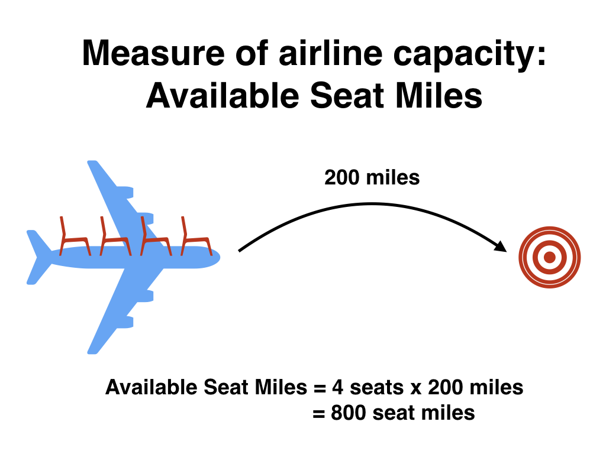

<style>
h1{font-weight: 400;}
</style>

```{r setup, include=FALSE}
knitr::opts_chunk$set(
  echo = TRUE, message=FALSE, warning = FALSE, eval = TRUE, 
  fig.width = 16/2, fig.height = 9/2
)

# tidyverse R packages:
library(ggplot2)
library(dplyr)
library(tibble)
library(tidyr)
library(readr)
library(purrr)
library(forcats)
library(stringr)
library(lubridate)
library(forcats)

# CRAN R packages:
library(knitr)
library(fivethirtyeight)
library(nycflights13)
library(gapminder)
library(babynames)
library(scales)
library(moderndive)
library(leaflet)
library(maps)
library(mapproj)
library(patchwork)

# Set seed value of random number generator to get "replicable" random numbers.
# Why 76? Because of https://www.youtube.com/watch?v=xjJ7FheCkCU
set.seed(76)
```

<style>
h1{font-weight: 400;}
</style>

***

# Schedule 

**Topics**:

1. Data visualization (pink): Grammar of Graphics, Five Named Graphs (5NG), color theory.
1. Working with data (blue): data wrangling, importing, and formatting
1. Maps and spatial data (green): Maps and geospatial data.
1. Learning how to learn new data science tools (yellow): SQL, TBD.

Note that while topics and topics dates may change, all problem sets (PS), project, and midterm dates will not. 


<iframe src="https://docs.google.com/spreadsheets/d/e/2PACX-1vRvggFhESyu_EFxrcFQXsZtdaQqaqcQ6kgWg173WTkTeWV67RWiZ01G8jhJsQ2b5VUVCJqQ8xo6COWM/pubhtml?gid=833934180&amp;single=true&amp;widget=true&amp;headers=false" width="100%" height="850"></iframe>

<!--
{target="_blank"}
-->


***


# Lec 38: Fri 12/10 {#Lec38}

## Announcements

* Today: the in-class data assistants will hold office hours
* **Final project due date/time is Friday 12/17 at 2pm (not 9pm)**


## Today's Topics/Activities

### 1. In-class exercise

* Work on Final Project


***


# Lec 37: Wed 12/8 {#Lec37}

## Announcements

* ModernDive will always be free, always available at [ModernDive.com](https://moderndive.com/)
* For Friday's lecture the in-class data assistants will hold office hours
* Finals week:
    + I've posted office hours for next week
    + **Final project due date/time is Friday 12/17 at 2pm (not 9pm)**
* Spinelli center notes:
    + Friday 12/10 is final Spinelli drop-in tutoring hours
    + Thank you to the in-class data assistants Marium, Emma, Sunni, and Swaha
    + Thank you to the Spinelli Center tutors
* Reflection exercise
* Time to fill out course evaluations


## Today's Topics/Activities

### 1. In-class exercise

* Work on Final Project


***


# Lec 36: Mon 12/6 {#Lec36}

## Announcements

* Go over final project submission instructions
* Wednesday is final lecture I'll be present; on Friday the Spinelli data assistants will hold in-class office hours.
* Note on coding style
    + Check out the [`tidyverse` style guide](https://style.tidyverse.org/){target="_blank"}.
    + Why is it important to write clean code, that is well documented, and actually works? To be mindful of the work you create for your [most important collaborator](https://rmhogervorst.nl/cleancode/blog/2016/05/26/content/post/2016-05-26-your-most-valuable-collaborator-future-you/){target="_blank"}.


## Today's Topics/Activities

### 1. In-class exercise

* Test two useful packages below: 
    + `patchwork`: Combine two ggplots together
    + `janitor`: Clean-up messy variable names
* Work on Final Project

```{r, eval=FALSE}
library(tidyverse)

# 1. Combine two ggplots together using patchwork package:
library(patchwork)

plot_1 <- ggplot(mtcars) + geom_point(aes(mpg, disp))
plot_2 <- ggplot(mtcars) + geom_boxplot(aes(gear, disp, group = gear))

# Side-by-side:
plot_1 + plot_2

# On top of each other:
plot_1 / plot_2


# 2. Say we have a data frame with really messy names:
data_frame_ugly <- tibble(
  `asdf ?!? qwerty%` = c(1, 2),
  variable.name...NAMES = c(2,1)
)
data_frame_ugly

# You can clean them very easily using the clean_names() function from the 
# janitor package
library(janitor)
data_frame_clean <- data_frame_ugly %>% 
  clean_names()
data_frame_clean
```


***


# Lec 35: Fri 12/3 {#Lec35}

## Announcements

* MTH/SDS tenure track search email
* Final project:
    + Open Slack to `#final_project` channel
    + Group leader: Create a Slack DM with all members AND myself and say "we're a group"
    + Submission details for Final Project to be posted on Monday.
* If you haven't already download and install [MySQL Workbench](https://dev.mysql.com/downloads/workbench/){target="_blank"}

## Today's Topics/Activities

### 1. Chalk Talk

* `dplyr` and SQL are very similar. Both based on the same idea of [database normalization](https://en.wikipedia.org/wiki/Database_normalization){target="_blank"} (1970).
* Moral of the story: If you know the `dplyr` package for data wrangling, you can learn SQL very quickly.

### 2. In-class exercise

Perform 2-3 SQL queries to convince yourself that if you know `dplyr`, you can learn SQL very quickly. This exercise is based on Prof. Baumer's [lecture notes](https://beanumber.github.io/sds192/lectures/29-sql.html#1){target="_blank"}.

1. Setup
    1. Install and open [MySQLWorkbench](https://dev.mysql.com/downloads/workbench/){target="_blank"}; this whole process takes about 10 minutes and necessitates creating an account with Oracle.
    1. Close the "Welcome to MySQL Workbench" message
    1. Click the plus sign next to "MySQL Connections" to add a connection to a SQL database.
    1. Setup a new connection" as shown in `#general` in Slack
    1. Click the resulting "Playing with SQL" connection and input the password in `#general` in Slack
1. Running SQL code
    1. Copy and paste the code below into the Query window
    1. For each of the 10 code segments: highlight it and then run it by clicking the "lightning" icon.

<script src="https://gist.github.com/rudeboybert/35098400f4f36c36fc5d0e96cb40786d.js"></script>


***


# Lec 34: Wed 12/1 {#Lec34}

## Announcements

* Download and install [MySQL Workbench](https://dev.mysql.com/downloads/workbench/){target="_blank"} before Friday's lecture
* Before chalk talk:
    1. Download the following zip file: <a href="static/example_webpage.zip" download>`example_webpage.zip`</a>
    1. Move `example_webpage.zip` to your SDS192 folder on your computer
    1. Unzip `example_webpage.zip`. Windows users: be sure to "Extract all"
    1. In the resulting `example_webpage` folder, double-click the RStudio Project `example_webpage.Rproj` icon to open RStudio Project mode
    

## Today's topics/activities


### 1. Chalk talk

`example_webpage` is a portion of the [R Markdown Websites](https://rmarkdown.rstudio.com/lesson-13.html){target="_blank"} code for this course webpage: 

* Inputs: `.Rmd` and `_site.yml` files
* Output: webpage in `docs/` folder, in particular the `index.html` mainpage
* "Deploying" your webpage: Many ways


### 2. In-class exercise

Today you'll modify the source code for `example_webpage` and then deploying this webpage using [Netlify drop](https://app.netlify.com/drop){target="_blank"}:

<center>
<iframe width="560" height="315" src="https://www.youtube.com/embed/-LRlQ_jaLAU" frameborder="0" allow="accelerometer; autoplay; encrypted-media; gyroscope; picture-in-picture" allowfullscreen></iframe>
</center>
</br>

1. Create an account on netlify.com using your GitHub account
    + Log into [GitHub](https://github.com/){target="_blank"} first. If you haven't created an account, do so using **using your Smith email address**.
    + Sign into [Netlify](https://app.netlify.com/){target="_blank"} using your GitHub account
1. Change and build your website locally (on your computer)
    + In `index.Rmd` change the `author` from `"Albert Y. Kim"` to you and change the `title`
    + Build your R Markdown Website by going to the "Build" panel of RStudio -> Clicking "Build Website".  
    You can also use the keyboard shortcuts:
        * macOS: Command+Shift+B
        * windows: Control+Shift+B
    + Inspect your webpage in your browser
1. Deploy your R Markdown Website
    + Go to [Netlify Drop](https://app.netlify.com/drop){target="_blank"}
    + Drag-and-drop the `docs/` folder output in your `example_webpage` RStudio Project folder.
    + If you want to rename your webpage's URL rather than use the default one you've been assigned: Click on "Domain settings" -> Click on the "..." next to your default site name -> Click on "Edit site name" -> Rename your site


***


# Lec 33: Mon 11/29 {#Lec33}

## Announcements

* Candidates for two new SDS faculty will be on campus this week and next
    + For data science position: See "Meet the SDS Data Science New Faculty Candidates!" email sent to SDS student mailing list. 
    + For joint MTH/SDS position: To be confirmed soon.
    + Because of this office hours are highly inconsistent and variable this week. However, they will always be confirmed and posted at least 24h in advance. 
* Final project in groups of 2-3 will be assigned on Wednesday and due Fri 12/17 9pm (last day of exams). You can choose your group. 
* PS07 posted
* To do before chalk talk
    + If you haven't already, create an account on GitHub.com **using your Smith email address**. If you already have a GitHub account, make sure your Smith email is in your Profile settings.
    + Open the GitHub repo for the [`fivethirtyeight`](https://github.com/rudeboybert/fivethirtyeight){target="_blank"} R package


## Today's topics/activities

### 1. Chalk talk

GitHub: Theory and terminology

* What is git?
* What is GitHub?
* Terminology: Repo, local vs remote, clone, pull, commit/push
* Most important files in any repo: `README.md`

### 2. In-class exercise

* Work on MP3 (due tomorrow at 9pm), don't forget to submit your Peer Evaluation Google Form.
* Work on PS07


***


# Lec 32: Mon 11/22 {#Lec32}

## Announcements

* MP3 now due Tuesday 11/30 at 9pm (after break). There will be no extensions past this due date/time.

## Today's topics/activities

### 1. Chalk talk

* None

### 2. In-class exercise

* Work on MP3


***


# Lec 31: Fri 11/19 {#Lec31}

## Announcements

* MP3 now due Tuesday 11/30 at 9pm (after break). There will be no extensions past this due date/time.


## Today's topics/activities

### 1. Chalk talk

* None

### 2. In-class exercise

* Work on MP3


***


# Lec 30: Wed 11/17 {#Lec30}

## Announcements

* Slack messages
* [Data Research and Statistics Counselor](https://www.smith.edu/qlc/tutoring.html?colDataCnslr=open#PanelDataCnslr){target="_blank"} Osman Keshawarz
* Poll


## Today's topics/activities

### 1. Chalk talk

* Recap of all `sf` data frames seen so far in MP3 Project -> `examples.Rmd`
* [Federal Information Processing Standard](https://en.wikipedia.org/wiki/FIPS_county_code){target="_blank"} (FIPS) codes for counties  
    { width=300px }
* Example: Looking up the [database](https://transition.fcc.gov/oet/info/maps/census/fips/fips.txt#:~:text=FIPS%20codes%20are%20numbers%20which,to%20which%20the%20county%20belongs.){target="_blank"}:
    + 25XXX = Massachusetts counties
    + 25105 = Hampshire County, Massachusetts
* From MP3 Project -> `examples.Rmd` -> Section 3 -> Look at contents of `mass_pop_orig` -> `GEOID` variable:

```{r, eval = FALSE}
> mass_pop_orig
Simple feature collection with 14 features and 7 fields
Geometry type: MULTIPOLYGON
Dimension:     XY
Bounding box:  xmin: -73.50814 ymin: 41.23796 xmax: -69.92839 ymax: 42.88659
Geodetic CRS:  NAD83
First 10 features:
   GEOID                             NAME   variable estimate moe
1  25017  Middlesex County, Massachusetts B01003_001  1600842  NA
2  25025    Suffolk County, Massachusetts B01003_001   796605  NA
3  25001 Barnstable County, Massachusetts B01003_001   213496  NA
4  25027  Worcester County, Massachusetts B01003_001   824772  NA
5  25011   Franklin County, Massachusetts B01003_001    70577  NA
6  25013    Hampden County, Massachusetts B01003_001   467871  NA
7  25015  Hampshire County, Massachusetts B01003_001   161032  NA
8  25021    Norfolk County, Massachusetts B01003_001   700437  NA
9  25005    Bristol County, Massachusetts B01003_001   561037  NA
10 25009      Essex County, Massachusetts B01003_001   783676  NA
```


### 2. In-class exercise

* Work on MP3


***


# Lec 29: Mon 11/15 {#Lec29}

## Announcements

* Work on MP3 this Wed, Fri, and Mon before Thanksgiving break.


## Today's topics/activities

### 1. Chalk talk

* [Application Programmer Interfaces](https://en.wikipedia.org/wiki/Application_programming_interface){target="_blank"}
* Choropleth maps. In particular, how you set the *bins* corresponding to the color gradient can affect how your map looks. As indicated [here](https://gisgeography.com/choropleth-maps-data-classification/){target="_blank"}, there are two approaches:
    + Equally sized interval bins
    + Quantile based bins


### 2. In-class exercise

* Go over code in MP3 folder -> `examples.Rmd` -> Section 3 on "Choropleth maps using census data"
* You will need to register an API key from the census bureau. Carefully read warning message to do so. 


***


# Lec 28: Fri 11/12 {#Lec28}

## Announcements

* Grad school panel on Mon 11/22 featuring SDS alumna. More info in `#general`

## Today's topics/activities

### 1. Chalk talk

* Guest lecture by the [Smith College Spatial Analysis Lab](http://www.science.smith.edu/sal/){target="_blank"}.


### 2. In-class exercise

1. Work on PS06. This is direct practice for MP3.
1. Then start on MP3.


***


# Lec 27: Wed 11/10 {#Lec27}

## Announcements

* Check important Slack announcement in `#general`
* [Mini-Project 3](projects.html#MP3) posted.


## Today's topics/activities

### 1. Chalk talk

1. Example solutions to `examples.Rmd` Section 1 exercise. Code posted in `#mp3`; screencast below
1. Shapefiles
<!--
1. Centroids: [Geographic](https://en.wikipedia.org/wiki/Geographic_center_of_the_contiguous_United_States){target="_blank"} and [population](https://en.wikipedia.org/wiki/Mean_center_of_the_United_States_population){target="_blank"} weighted. Not coincidentally, check out where FedEx and UPS main airport hubs are [located](https://www.google.com/maps/dir/UPS+Worldport,+Grade+Lane,+Louisville,+KY/FedEx+World+Hub,+2903+Sprankel+Ave,+Memphis,+TN+38118/@36.6002171,-90.0693041,7z/data=!3m1!4b1!4m14!4m13!1m5!1m1!1s0x88690c2c6dc6fe95:0xae70a6ac610364fe!2m2!1d-85.7307215!2d38.1657255!1m5!1m1!1s0x887f87b59bc63573:0x37d7df503bee2e8f!2m2!1d-89.9608239!2d35.0674784!3e0){target="_blank"}.
-->

<iframe width="560" height="315" src="https://www.youtube.com/embed/esQrPSJfFkU" title="YouTube video player" frameborder="0" allow="accelerometer; autoplay; clipboard-write; encrypted-media; gyroscope; picture-in-picture" allowfullscreen></iframe>


### 2. In-class exercise

While you are free to work in any order you like, I suggest you:

1. Go over solutions to `examples.Rmd` -> Section 1 on "Converting data frames to sf objects"
1. Go code for Section 2 "Loading shapefiles into R". This is direct practice for PS06. 
1. Work on PS06. This is direct practice for MP3.
1. Then start on MP3.


***


# Lec 26: Mon 11/8 {#Lec26}

## Announcements

* Mini-project 3 (MP3) assigned on Wednesday, due Tuesday 11/23 at 9pm.
    + Add yourselves to the `#mp3` channel. Please ask all questions about MP3 in `#mp3`, not in `#questions`
    + By Tuesday 5pm I will post the new groups (of two) in the `#mp3` channel. Until `#mp3` is due, you will sit next to your partner in class.
    + Please reach out to your partner with a Slack DM before Wednesday's lecture to coordinate meeting before lecture so you can sit next to each other.
    + If you have seating restrictions due to hearing, sight, or mobility issues, please DM me.
* PS06 to be posted by this evening
* Compare the following London underground maps. As stated in this [article](https://www.theverge.com/2015/11/11/9712376/london-walk-tube-underground-map){target="_blank"}, the transit map on the right sacrifices accuracy for clarity.
    + The map of stations as they truly exist: 
    { width=700px }
    + The transit map inside the stations and trains. All lines are either straight or at 45 degrees and futhermore the geographic space is distorted. 
    { width=700px }


## Today's topics/activities

* Download <a href="static/projects/MP3/MP3.zip" download>`MP3.zip`</a>
* Move `MP3.zip` to your SDS192 folder on your computer
* Unzip `MP3.zip`. Windows users: be sure to "Extract all"
* In the resulting MP3 folder, double-click the RStudio Project `MP3.Rproj` icon  
    { width=100px }  
* Verify that RStudio opens with MP3 written in the top-right  
    { width=100px }    
    

### 1. Chalk talk

<!--
* DO THIS: Have all students install Rcpp package before sf package. Otherwise there might be RStudio fatal errors
* Reading of "On Exactitude in Science" by Borges.
* Slides on [GIS](https://beanumber.github.io/sds192/lectures/24-shapefiles.html#17){target="_blank"}
-->


* RStudio Projects
* `sf` package for static maps in `ggplot2` and loading shapefiles. See [Spatial Data Science](https://keen-swartz-3146c4.netlify.com/){target="_blank"} for more.

    

### 2. In-class exercise

* In MP3 folder -> `examples.Rmd` -> Section 1 on "Converting data frames to sf objects", do exercises


***


# Lec 25: Fri 11/5 {#Lec25}

No lecture today, instead optional in-class office hours:

* Sec02 Sabin-Reed 220: 9:25-10:25
* Sec01 Stoddard G2: 10:55-11:55


***


# Lec 24: Wed 11/3 {#Lec24}

## Announcements

* Slack note in `#random`
* No office hours tomorrow (Thursday). Instead, optional in-class office hours on Friday.


## Today's topics/activities

### 1. Chalk talk

* Practice midterm posted in `#midterms`
* "When would you use left or right join?"


### 2. In-class exercise

* Open office hours


***


# Lec 23: Mon 11/1 {#Lec23}

## Announcements

* Practice midterm posted on Slack in `#midterms`; we'll go over solutions on Wednesday
* Midterm II discussion: see [midterms](midterms.html#midtermII) page


## Today's topics/activities

### 1. In-class exercise

* Work on MP2


***


# Lec 22: Fri 10/29 {#Lec22}

## Announcements

* Useful RStudio cheatsheets: Go to RStudio menu bar on top -> Help -> Cheatsheets:
    + Data Transformation with `dplyr`
    + Data Visualization with `ggplot2`


## Today's topics/activities

### 1. Chalk talk

* Install and then load the `tidyverse` package: An *umbrella* package that installs/loads many useful packages for data science all at once.
    + See [tidyverse.org](https://www.tidyverse.org/){target="_blank"} for more info.
    + [R for Data Science](https://r4ds.had.co.nz/){target="_blank"} is a good reference for these tools
    + In other words, from now on:  
    ```{r, eval = FALSE}
    # Don't do all this:
    library(ggplot2)
    library(dplyr)
    library(readr)
    library(tidyr)
    library(stringr)
    library(tibble)
    library(forcats)
    library(purrr)
    
    # Instead, do this:
    library(tidyverse)
    ```


### 2. In-class exercise

* Work on MP2


***


# Lec 21: Wed 10/27 {#Lec21}

## Announcements

* Mid-Semester Assessment:
    + 1m26s [video](https://smith.zoom.us/rec/play/O14VUQdkLmLYk8rVIUTiZV5srowJnD1WY0ea32Src58MxBebmzApFoLj6QC7yIP07qryBdY_BTyC0mMr.uem-p46i7C1polTP?startTime=1632337008000&_x_zm_rtaid=xnfz95AGRVq1Q6k5BMaobg.1635335436110.113b109a84ea1ad5c5d637f778892a5a&_x_zm_rhtaid=173){target="_blank"}
    + [Link to survey](https://smithcollege.qualtrics.com/jfe/form/SV_6rPDOKOBtfkvWJw){target="_blank"}
* Talk about Spring 2022 SDS courses
* Added "Tips & Tricks" tab to menu bar of course webpage
* Update to syllabus
* For a truly unique perspective on Data Visualization: Mona Chalabi [\@monachalabi](https://www.instagram.com/monachalabi/?hl=en){target="_blank"}. See video below:

<iframe width="560" height="315" src="https://www.youtube.com/embed/IRJ2Ac9vI5o" title="YouTube video player" frameborder="0" allow="accelerometer; autoplay; clipboard-write; encrypted-media; gyroscope; picture-in-picture" allowfullscreen></iframe>


## Today's topics/activities

### 1. Chalk talk

* None

### 2. In-class exercise

* Work on MP2


***


# Lec 20: Mon 10/25 {#Lec20}

## Announcements

* MP1 grades posted: See Slack `#mp1` for details
* SDS is currently working hard to hire [3 new faculty](https://docs.google.com/presentation/d/1ZJ8Xc_9AzlYd4HKrKK-7aaZEb7Y9BqfxluyO4eyWUGw/present#slide=id.gd84b73b16_0_52){target="_blank"} who will start in July 2022; I'm chairing one committee and sitting on another. As a result for the next month
    + My office hours will be highly variable; consult the calendars in the syllabus often
    + There will unfortunately be lags in returning grading
    + Sec01 Stoddard only: I won't be able to stay past 12:05pm so that I can attend lunch meetings.


## Today's topics/activities

### 1. Chalk talk

* Recap of Lec19: Why did we use `inner_join()` for solution to LC 3.20 on computing Available Seat Miles
* Importing spreadsheet data into R. Either Excel files or `.csv` Comma-Separated Values files. See image of example `.csv` file below.
* [Data formats](https://en.wikipedia.org/wiki/Wide_and_narrow_data){target="_blank"}: "tidy" AKA long/tall/narrow format versue "non-tidy" AKA wide format

<center>
{ width=500px }
</center>
<br>


### 2. In-class exercise

* Go over ModernDive reading in schedule above


***


# Lec 19: Fri 10/22 {#Lec19}

## Announcements

* MP1 returned by Monday
* E-commerce concept: [conversion funnel](https://sleeknote.com/blog/e-commerce-sales-funnel){target="_blank"}
* Check out the Smith [Common Goods Resource Center](https://www.smith.edu/student-life/commongoods){target="_blank"}
* Struggling with data wrangling? Don't worry, that's normal since ["90% of data science is data wrangling."](https://blog.rstudio.com/2020/05/05/wrangling-unruly-data/){target="_blank"}
* There are lots of "90% of data science is ..." quotes:

<blockquote class="twitter-tweet"><p lang="en" dir="ltr">90% of data science in industry is <a href="https://t.co/ikKWmeqw7O">pic.twitter.com/ikKWmeqw7O</a></p>&mdash; Jeep Wrangler Owner (@asmae_toumi) <a href="https://twitter.com/asmae_toumi/status/1450864160326172673?ref_src=twsrc%5Etfw">October 20, 2021</a></blockquote> <script async src="https://platform.twitter.com/widgets.js" charset="utf-8"></script>


## Today's topics/activities

### 1. Chalk talk

* Pseudocode to compute Available Seat Miles

### 2. In-class exercise

* Work on MP2


***


# Lec 18: Wed 10/20 {#Lec18}

## Announcements

* Slack:
    + See `#general` Slack channel and give feedback on Spinelli tutors
    + Practice making text look like `code`: create a DM with your project partner and let's practice.
* Discuss [Mini-Project 2](projects.html#MP2) in full detail
* Feel free to message me on weekends, I just likely won't respond.


## Today's topics/activities

### 1. Chalk talk

* What is pseudocode?
* Types of joins:
    + Copy code below to your `classnotes.Rmd`
    + Refer to image (ignore `semi_join()`)
    ```{r, echo=FALSE, fig.align='center'}
      include_graphics("static/images/joins.png")
    ```

<script src="https://gist.github.com/rudeboybert/968dbf26d5f9407703ae7b24d217af67.js"></script>


### 2. In-class exercise

With your MP2 partner, practice data wranling! Complete ModernDive Learning Check 3.20: Using data in `nycflights13` package, compute available seat miles for each airline separately:

1. Write out the pseudocode first
2. Then code it

```{r, echo=FALSE, fig.align='center'}

```


***


# Lec 17: Mon 10/18 {#Lec17}

## Announcements

* [Mini-Project 2](projects.html#MP2) posted
* PS05 to be posted by this evening
* If you're curious about my experiences in grad school, working at Google, switching to academia, and advice for aspiring data scientists, check out my appearance on episode #43 of the DataBytes podcast "To Google and Back." Also available on [Apple Podcasts](https://podcasts.apple.com/us/podcast/43-to-google-and-back/id1445241846?i=1000452290536){target="_blank"} and [Google Play](https://play.google.com/music/listen?u=0#/ps/Itfclix7dvr5c2kbtovrtufki2a){target="_blank"}.

<center>
<iframe src="https://open.spotify.com/embed-podcast/episode/4SEcmLwHdJfmXaQEY7NZlV" width="70%" height="232" frameborder="0" allowtransparency="true" allow="encrypted-media"></iframe>
</center>
<br>


## Today's topics/activities

### 1. Chalk talk

* Adding to previous lectures:
    + Lec15 on `group_by()` and `summarize()`: difference between `sum()` and `n()` summary functions.
    + Lec16 on `mutate()`: `ifelse()` function
* `_join()`, `select()`, and `rename()` functions

<!--
2021/10 fall note: Focus on inner_join first, do left & right later
-->

### 2. In-class exercise

* Go over ModernDive reading in schedule above


***


# Lec 16: Fri 10/15 {#Lec16}

## Announcements

* Mini-project 2 (MP2) assigned on Monday
    + Add yourselves to the `#mp2` channel. Please ask all questions about MP2 in `#mp2`, not in `#questions`
    + By Sunday 5pm I will post the new groups (of two) in the `#mp2` channel. Until `#mp2` is due, you will sit next to your partner in class.
    + Please reach out to your partner with a Slack DM before Monday's lecture to coordinate meeting before lecture so you can sit next to each other.
    + If you have seating restrictions due to hearing, sight, or mobility issues, please DM me.


## Today's topics/activities

### 1. Chalk talk

* `mutate()` new columns/variables and `arrange()` i.e. sort rows


### 2. In-class exercise

* Go over ModernDive reading in schedule above


***


# Lec 15: Wed 10/13 {#Lec15}

## Announcements

* See Slack `#general` for info about presentation of SDS major
* PS04 (shorter) will be posted this afternoon
* Keyboard shortcuts for:
    1. `%>%` in RStudio: command + shift + m on macOS, control + shift + m on Windows
    1. Running code in RStudio: command + enter on macOS, control + enter on Windwos
    1. Quickly jumping between apps: command + tab on macOS, alt + tab on Windows
    1. Selecting many files at once: click first file, hold shift, click last file
    1. Deleting files: command + delete on macOS, delete on Windows


## Today's topics/activities

### 1. Chalk talk

* `summarize()` rows and `group_by() %>% summarize()`

### 2. In-class exercise

* Put finishing touches on MP1
* Go over ModernDive reading in schedule above


***


# Lec 14: Fri 10/8 {#Lec14}

## Announcements

* You are responsible for completing the ModernDive readings for Lec13 on the `%>%` operator and `filter()` before Wednesday's lecture
* A shorter PS04 will be assigned on Wednesday, due on Monday 10/18 9pm


## Today's topics/activities

### 1. Chalk talk

* None

### 2. In-class exercise

* Work on MP1


***


# Lec 13: Wed 10/6 {#Lec13}

## Announcements

* ["File not found"](https://www.theverge.com/22684730/students-file-folder-directory-structure-education-gen-z){target="_blank"}; the struggle is real for instructors. 


## Today's topics/activities

### 1. Chalk talk

* Computer file theory
    + What are folders/directories?
    + How does R Markdown find the `.ics` file?
    + What are `.zip` files? Special note for Windows users
    + Computer file hygiene: Delete files you don't need anymore
* Intro to data wrangling
    + Pipe operator `%>%` pronounced "then"
    + `filter()` rows that meet a certain criteria


### 2. In-class exercise

* Go over ModernDive reading in schedule above


***


# Lec 12: Mon 10/4 {#Lec12}

## Announcements

* Midterm:
    + No talking about it until after 5pm today please; there is one or more students who need to take it.
    + Why student ID and not name? For anonymized grading.
* Update to office hours on syllabus 
* MP1:
    + Lecture schedule for Wed, Fri, and Wed after break
    + Post questions about MP1 in `#mp1` on Slack
* Discussion on managing group dynamics:
    + Life happens. If it does and it will affect you work, at the very least communicate and give your partner a heads up (text, Slack, etc.)
    + What to do when issues arise? 
    + Don't forget you'll be filling out peer evaluation [Google Form](https://docs.google.com/forms/d/e/1FAIpQLSd6w4CC9-PrWrpupNfosQUBVoCWBihRwdezYb2jJEj7-kNdfg/viewform){target="_blank"}


<!--
- where to put color aes, in ggplot or geom
- quotation marks
- minutes coming out wrong
- colors
--> 


## Today's topics/activities

### 1. Chalk talk

* Trend lines via a `geom_smooth()` layer. Two types:
    + Linear regression
    + [LOWESS](https://www.statisticshowto.com/lowess-smoothing/): Locally Weighted Scatterplot Smoothing
    
* Example code:

```{r, eval=FALSE}
library(ggplot2)
library(dplyr)
library(gapminder)

# 1. Recreate plot from PS02 but with no color:
gapminder_2007 <- gapminder %>% 
  filter(year == 2007)

# 1.a) Add LOESS smoother layer with geom_smooth()
ggplot(data = gapminder_2007, mapping = aes(x = gdpPercap, y = lifeExp, size = pop)) +
  geom_point() +
  geom_smooth()

# 1.b) Remove standard error bars by setting se = FALSE
ggplot(data = gapminder_2007, mapping = aes(x = gdpPercap, y = lifeExp, size = pop)) +
  geom_point() +
  geom_smooth(se = FALSE)

# 1.c) Change span of "smoothing" window by change the value of span
ggplot(data = gapminder_2007, mapping = aes(x = gdpPercap, y = lifeExp, size = pop)) +
  geom_point() +
  geom_smooth(se = FALSE, span = 0.25)

# 1.d) Force line to be straight. i.e. linear regression
ggplot(data = gapminder_2007, mapping = aes(x = gdpPercap, y = lifeExp, size = pop)) +
  geom_point() +
  geom_smooth(method = "lm", se = FALSE)
```


### 2. In-class exercise

* Copy the example code above to your `classnotes.Rmd` and go over the code
* Optional: Go over ModernDive reading in schedule above (this topic is covered in SDS 201/220 intro stats)
* Work on MP1


***


# Lec 11: Fri 10/1 {#Lec11}

## Announcements

* Open Slack at the start of **every** lecture
    + Check for DM's
    + Check `#midterms` channel
* In order to not disadvantage students who take the midterm earlier
    + I won't be answering any Slack `#midterms` after 3pm today
    + I've instructed the Friday Spinelli tutor not to answer questions about the midterm


## Today's topics/activities

### 1. Chalk talk

* Go over practice Midterm I. Boxplot for question 3.c):
    ```{r, echo = FALSE}
    prices <- c(-11, 12, 15, 20, 20, 
                30, 30, 30, 30, 40, 
                40, 40, 40, 41, 51)
    tibble(prices = prices) %>% 
      ggplot(aes(x = "", y = prices)) +
      geom_boxplot() +
      coord_flip() +
      labs(x = "", y = "Book price in $")
    ```


### 2. In-class exercise

* Work on MP1


***


# Lec 10: Wed 9/29 {#Lec10}

## Announcements

* Sit next to your MP1 partner; your partner was posted in the `#mp1` channel on Sunday 5pm.
* If have an Office of Disability Services accommodations letter and you haven't already, please Slack DM it to me. 
* [Midterm I](midterms.html#midtermI) info posted
* [Mini-Project 1](projects.html#MP1) info posted


<blockquote class="twitter-tweet"><p lang="en" dir="ltr">Our department is offering a pre-application review service (PARS) initiative to provide support and mentorship to PhD applicants from from historically marginalized groups. See details here: <a href="https://t.co/1g8lol4dRf">https://t.co/1g8lol4dRf</a> <a href="https://t.co/rHaMFHr5GF">pic.twitter.com/rHaMFHr5GF</a></p>&mdash; UW Statistics (@UWStat) <a href="https://twitter.com/UWStat/status/1441591608709812227?ref_src=twsrc%5Etfw">September 25, 2021</a></blockquote> <script async src="https://platform.twitter.com/widgets.js" charset="utf-8"></script>


## Today's topics/activities

### 1. Chalk talk

* Recap of color palettes from [colorbrewer2.org](http://colorbrewer2.org/){target="_blank"}
    + `fill` vs `color` aesthetics and `brewer` vs `manual`
    + You can also download color palettes in R packages, like [`viridis`](https://cran.r-project.org/web/packages/viridis/vignettes/intro-to-viridis.html){target="_blank"}
* Discuss [Midterm I](midterms.html#midtermI)
* Discuss [Mini-Project 1](projects.html#MP1)

### 2. In-class exercise

* With your partner, build a minimally viable product of your MP1

<!--

* Go over ModernDive 2.9. In particular in Section 2.9.3, open the `ggplot2` cheatsheet in RStudio and read over the different `geom` types

-->


***


# Lec 09: Fri 9/24 {#Lec09}

## Announcements

* On Slack `#general`: new SDS student lounge in McConnell 209
* Additional resource: Prof. Ben Baumer's book [Modern Data Science with R](https://mdsr-book.github.io/mdsr2e/){target="_blank"} used in his version of SDS 192.
* Mini-project 1 (MP1) assigned on Monday
    + Slack demo of how to subscribe to a `#channel`: Adding yourselves to the `#mp1` channel. Please ask all questions about MP1 there
    + You will be assigned groups for MP1, MP2, and MP3. You can choose your groups for the final project.
    + By Sunday 5pm I will post the groups (of two) in the `#mp1` channel. Until `#mp1` is due, **you will sit next to your partner in class**.
    + Please reach out to your partner with a Slack DM before Monday's lecture to coordinate meeting before lecture so you can sit next to each other.


## Today's topics/activities

### 1. Chalk talk

* Recap of barplots: Exercise on pie charts vs barplots below
* Color theory
    1. `color` vs `fill` aesthetics in `ggplot2`
    1. Selecting an appropriate color palette from [colorbrewer2.org](http://colorbrewer2.org/){target="_blank"}
    { width=600px }
    1. How does `ggplot2` pick default colors? Using a [color wheel](https://stackoverflow.com/questions/21490210/how-to-plot-a-colour-wheel-by-using-ggplot){target="_blank"}
    1. Also define colors in terms of [hex codes](https://www.color-hex.com/color/f8766d){target="_blank"}


    
### 2. Exercise on pie charts vs barplots

Say the following piecharts represent results of an election poll at time points: A = September, B = October, and C = November. At each time point we present the proportion of the poll respondents who say they will support one of 5 candidates: 1 through 5. 

{ width=600px }

Based on these 3 piecharts, answer the following questions:

1. At time point A, is candidate 5 doing better than candidate 4?
1. Did candidate 3 do better at time point B or time point C?
1. Who gained more support between time point A and time point B, candidate 2 or candidate 4?

Compare that to using barplots. Which do you prefer?

{ width=600px }


### 3. In-class exercise

* Go over ModernDive reading in schedule above.
* Changing default `color` and `fill` color aesthetics: 
    1. Copy and paste the code below into your `classnotes.Rmd` file
    1. Change both the color of the scatterplot points and the fill of the bars. You can do this by selecting a palette from [colorbrewer2.org](http://colorbrewer2.org/){target="_blank"} or by setting them manually
    1. Run `colors()` in your console to get English names of all colors in R

```{r, eval=FALSE}
library(ggplot2)
library(dplyr)
library(nycflights13)
library(gapminder)

# 1. Recreate plot from PS02, but change default "color" palette of points:
gapminder_2007 <- gapminder %>% 
  filter(year == 2007)
ggplot(gapminder_2007, aes(x = gdpPercap, y = lifeExp, size = pop, color = continent)) +
  geom_point() +
  scale_color_brewer(palette = "Set1")

# 2.a) Recreate Figure 2.26 but change default "fill" color of bars by adding a 
# palette layer:
ggplot(flights, aes(x = carrier, fill = origin)) +
  geom_bar(position = position_dodge(preserve = "single")) +
  scale_fill_brewer(palette = "Set1")

# 2.b) Recreate Figure 2.26 but change default "fill" color of bars by manually 
# changing colors in a layer:
ggplot(flights, aes(x = carrier, fill = origin)) +
  geom_bar(position = position_dodge(preserve = "single")) +
  scale_fill_manual(values = c("darkorange", "forestgreen", "navyblue"))

# 2.c) Recreate Figure 2.26 but change default "fill" color of bars by manually 
# changing colors in a layer using hex codes from: 
# https://www.color-hex.com/color-palette/114219
ggplot(flights, aes(x = carrier, fill = origin)) +
  geom_bar(position = position_dodge(preserve = "single")) +
  scale_fill_manual(values = c("#dc323a", "#003f77", "#c4c1c1"))
```


***


# Lec 08: Wed 9/22 {#Lec08}

## Announcements

* Problem sets:
    + PS01 graded
    + PS03 posted

<!--
* What kind of questions are appropriate for `#questions` Slack channel
-->


## Today's topics/activities

### 1. Chalk talk

* Searching the internet effectively: a critical data science tool
* Wrapping-up boxplots:
    + For a side-by-side boxplot, the x variable has to be categorical
    + Summary statistics that are robust to outliers: median and IQR
    + Why 1.5 x IQR?
* Barplots
    + `geom_bar()` when counts are not pre-computed i.e. listed individually
    + `geom_col()` when counts are pre-computed and saved in a variable


### 2. In-class exercise

* Go over ModernDive reading in schedule above.


***


# Lec 07: Mon 9/20 {#Lec07}

## Announcements

* Office of Disability Services is looking to hire a note taker for the class. If interested, see note in Slack `#general`. 
* Problem sets:
    + PS02 due today at 5pm
    + PS03 to be posted by 6pm today


## Today's topics/activities

### 1. Chalk talk

* Recap of histograms
* Facets to split a visualization by the values of another variable
* Default ordering of functions such as `ggplot()` where `data = ` is assumed first and `mapping = ` is assumed second
* Boxplots! Powerful, but tricky!


```{r, eval=TRUE, echo=FALSE}
library(ggplot2)
library(dplyr)
example <- tibble(
  values = c(1, 3, 5, 6, 7, 8, 9, 12, 13, 14, 15, 30)
)
```

Say we want to study the distribution of the following `r nrow(example)` values which are pre-sorted: 

> `r example %>% pull(values)`

They have the following *summary statistics*. A summary statistic is a single numerical value *summarizing* many values. Examples include the immediately obvious mean AKA average and median. Other less immediately obvious examples include:

* Quartiles (1st, 2nd, and 3rd) that cut up the data into 4 parts, each containing roughly one quarter = 25% of the data
* Minimum & maximum
* Interquartile-range (IQR): the distance between the 3rd and 1st quartiles

Min. | 1st Quartile | Median = 2nd Quartile  | 3rd Quartile  |  Max. | IQR
---- | ------- | ------  |  ------- | --- | ---
`r min(example$values)`  |  `r quantile(example$values, probs=0.25, type = 2)` |  `r median(example$values)`  |  `r quantile(example$values, probs=0.75, type=2)`  | `r max(example$values)` | 8 = 13.5 - 5.5


Let's compare the points and the corresponding boxplot side-by-side with the values on the $y$-axis matching:

```{r, echo=FALSE, eval=TRUE}
plot1 <- ggplot(example, aes(x=factor(1), y=values)) +
  geom_point() +
  labs(title = "Points") +
  theme(
    axis.title.x = element_blank(),
    axis.text.x = element_blank(),
    axis.ticks.x = element_blank()
  )

plot2 <- ggplot(example, aes(x=factor(1), y=values)) +
  geom_boxplot() +
  labs(title = "Boxplot") +
  theme(
    axis.title.x = element_blank(),
    axis.text.x = element_blank(),
    axis.ticks.x = element_blank()
  )
plot1 + plot2
```


### 2. In-class exercise

* Go over ModernDive reading in schedule above.


***


# Lec 06: Fri 9/17 {#Lec06}

## Announcements

<blockquote class="twitter-tweet"><p lang="en" dir="ltr">Oh snap! <a href="https://twitter.com/SmithCollegeSDS?ref_src=twsrc%5Etfw">@SmithCollegeSDS</a> is on a hiring spree! Put 👀 on these 3⃣ tenure track positions, apps due:<br><br>- 10/8 Biostatistics, statistics, or related<br>- 10/15 joint hire with the Math dept<br>- 10/22 candidates with a Ph.D. in stats, CS, information sciences, math, or related <a href="https://t.co/RCmtlSzg3S">https://t.co/RCmtlSzg3S</a></p>&mdash; Albert Y. Kim (@rudeboybert) <a href="https://twitter.com/rudeboybert/status/1438822302490275844?ref_src=twsrc%5Etfw">September 17, 2021</a></blockquote> <script async src="https://platform.twitter.com/widgets.js" charset="utf-8"></script>

## Today's topics/activities

### 1. Chalk talk

* In-class demo of using RMarkdown features in a `classnotes.Rmd` file to save lecture code
* Take screenshots of your screen!
    + macOS: Command+Shift+3 to take shot of whole screen, Command+Shift+4 to take subportion
    + Windows: [Shift-Windows Key-S and Snip & Sketch](https://www.pcmag.com/how-to/how-to-take-screenshots-in-windows-10){target="_blank"}
* Histograms for visualizing the *distribution* of a numerical variable


#### Section 1 (Stoddard G6) Demo

<iframe width="560" height="315" src="https://www.youtube.com/embed/AhRxFl3k_5E" title="YouTube video player" frameborder="0" allow="accelerometer; autoplay; clipboard-write; encrypted-media; gyroscope; picture-in-picture" allowfullscreen></iframe>

#### Section 2 (Sabin-Reed 220) Demo

<iframe width="560" height="315" src="https://www.youtube.com/embed/Xrf6ymv6o7E" title="YouTube video player" frameborder="0" allow="accelerometer; autoplay; clipboard-write; encrypted-media; gyroscope; picture-in-picture" allowfullscreen></iframe>


### 2. In-class exercise

* If you still haven't been able to "Knit to PDF", please ask for help
* Go over ModernDive reading in schedule above.


***


# Lec 05: Wed 9/15 {#Lec05}

## Announcements

* PS02 was posted after Monday's lecture.

## Today's topics/activities

### 1. Chalk talk

* Overplotting and two approaches for addressing it
* Linegraphs

### 2. In-class exercise

* Explore the different formatting tools in R Markdown: go to RStudio top menu bar -> Help -> Markdown quick reference.
* Sec01 in Stoddard: There was an typo in Step 8 in last lecture's in-class exercise. If you weren't able to Knit directly to PDF, please re-attempt Steps 8-9. Knitting directly to PDF, instead of Knitting to Word and then saving to PDF, is the preferred submission format for all problem sets. It will be less hassle for you and provide consistency for the graders. 
* Go over ModernDive reading in schedule above. 


***


# Lec 04: Mon 9/13 {#Lec04}

## Announcements

* Problem Set 02 due next Monday 5pm, now posted under [Problem Sets](PS.html)


## Today's topics/activities

### 1. Chalk talk

* Recap of previous lecture
* "Where can I save all the code I run in class?" In an R Markdown `.Rmd` file; R Markdown is a tool for *reproducible research*

**Input**: An `.Rmd` file  | **Output**: An `.html`, `.docx`, or `.pdf` file.
------------- | -------------
{ width=800px } | { width=800px }


### 2. In-class exercise

**In-class battle-testing and practicing for PS02:**

1. At a couple of steps in this process, you will be asked to install packages. Say yes to all of them.
1. If at any point your code won't knit, go through these [6 R Markdown Fixes](https://docs.google.com/document/d/1P7IyZ4On9OlrCOhygFxjC7XhQqyw8OludwChz-uFd_o/){target="_blank"} first, then seek assistance. **These 6 fixes will resolve 85% of issues.**
1. **Create new R Markdown `.Rmd` file**:
    + Go to RStudio menu bar -> File -> New File -> R Markdown 
    + Set "Title" to "My first R Markdown report" and "Author" as your name.
    + Save this file as `testing` somewhere on your computer. This will create a file called `testing.Rmd`
1. **Method 1: "Knit" a report to HTML**:
    + Click the arrow next to "Knit" -> "Knit to HTML".
    + An HTML webpage should pop up. However, it may be blocked by your browser. If so, in your browser's URL bar, click on "Always allow pop-ups".
1. **Method 1: Publish HTML report on web**:
    + Click on blue "Publish" button on top right of the resulting **pop-up html**.
    + Select RPubs.
    + If you haven't previously, create an account on Rpubs.com. If you have previously, login.
    + Set "Title" to "My first R Markdown report" and "Slug" to "testing"
    + You should end up with a webpage that looks like this [one](http://rpubs.com/rudeboybert/testing){target="_blank"}. This is live on the web!
1. **Method 1: Update HTML report on web**:
    + Make some trivial change to your `testing.Rmd` file.
    + "Re-knit" your report and make sure your trivial change is reflected.
    + The blue "Publish" button should now read "Republish"
    + Click "Update existing"
    + Your updates are now live on the web!
1. **Method 2: "Knit" a report to Word**
    + Click the arrow next to "Knit" -> "Knit to Word".
    + Save the resulting Word document as a pdf file.
1. **Only if you are a macOS user**:
    + Next to "Console" go to "Terminal"
    + Run this line of code:   
    ```{r, eval = FALSE}
    sudo chown -R `whoami`:admin /usr/local/bin
    ```
    + Enter your password. Note: Terminal has weird behavior whereby as you enter your password, the cursor will not move. Don't worry your password is registering. 
1. **Method 3: "Knit" a report to PDF**
    + Run the following code in your console just once:  
    ```{r, eval=FALSE}
    install.packages('tinytex')
    tinytex::install_tinytex()
    ```
    + Click the arrow next to "Knit" -> "Knit to PDF".


<!--
1. **Fiddle with RStudio settings**:
    + Go to RStudio menu bar -> Tools -> Global Options... -> R Markdown
    + Uncheck box next to "Show output inline for all R Markdown Documents"
-->

***


# Lec 03: Fri 9/10 {#Lec03}

## Announcements

* Spinelli Center [SDS drop-in tutoring hours](https://www.smith.edu/qlc/tutoring.html?colStats=open#PanelStats.){target="_blank"} now open! Get individual attention from SDS majors! In Sabin-Reed 301
    + Sunday through Thursday 7-9pm
    + Friday 2:35-3:30pm
* By popular request:
    + Sec 01 in Stoddard G2 will now start 5 minutes later: 10:55 AM instead of 10:50AM
    + Sec 02 in Sabin-Reed 220 will now end 5 minutes earlier: 10:35 AM instead of 10:40 AM
* I added extra instructions for Problem Set 01 after lecture, posted under [Problem Sets](PS.html)
    + Show don't tell how to tag questions on gradescope
* ASA StatFest 2021 Sat 9/18 thru Sun 9/19 [flyer](static/images/announcements/statfest2021.pdf){target="_blank"} and [event webpage](https://community.amstat.org/cmis/events/statfest/statfest-2021){target="_blank"}
    + Sunday 9/19 at 11:50AM: Opportunities in Statistics & Data Science in Academia, Government, & Non-Profit featuring SDS's **Prof. Randi Garcia**!
    + Keynote address by **Robert Santos**, 116th President of the ASA, and President Biden's nominee to serve as Director of the United States Census Bureau! If approved by the Senate, he would be the first Latinx Director of the Bureau!


## Today's topics/activities

### 1. Chalk talk

* Recap of previous lecture
* Grammar of Graphics
* 5NG1: Scatterplots
* Next time:
    + Question: Do I need to re-type my code in the Console every single time?
    + Answer: No! Save your work in an [RMarkdown document](https://rmarkdown.rstudio.com/){target="_blank"}

### 2. In-class exercise

* Go over ModernDive reading in schedule above. 


***


# Lec 02: Wed 9/8 {#Lec02}

## Announcements

* Problem Set 01 due this Monday 5pm, posted under [Problem Sets](PS.html).


## Today's topics/activities

### 1. Chalk talk

* Intro to Slack
* What is difference between R and RStudio?
* What are R packages?


### 2. In-class exercise

* Go over ModernDive reading in schedule above. 

*About readings in this course*:

* You are responsible for completing a lecture's readings before the next lecture. Ex: you are responsible to read all of ModernDive Chapter 1 before Wednesday.
* I teach lectures assuming you have not done the readings beforehand. However, if it suits your learning style better, please do read beforehand.
* While you don't need to turn in your learning check answers, I *highly* recommend you still do them. The solutions are in Appendix D of the book.
* If you have your headphones, you may listen to music during in-class reading time.


***


# Lec 01: Fri 9/3 {#Lec01}

## Announcements

Welcome!

## Today's topics/activities

* Course webpage: bit.ly/sds192kim
* My story
* "Knock on wood if you're with me"
* What this class is about: Answering questions with data
    1. Data viz
    1. Data wrangling
    1. Maps
    1. Websites
* Break!
* Executive summary of syllabus
* This weekend: Complete [intro survey](https://docs.google.com/forms/d/e/1FAIpQLSdA6uWnig5oR3ITCsVBFDxC6IC5Nq1tYzo-atdChe8CVTTqag/viewform){target="_blank"}


## Code examples from class

```{r, eval = FALSE}
# Data visualization
library(fivethirtyeight)
library(ggplot2)
library(dplyr)
year_bins <- c("'70-'74", "'75-'79", "'80-'84", "'85-'89", "'90-'94",
               "'95-'99", "'00-'04", "'05-'09", "'10-'13")

bechdel <- bechdel %>%
  mutate(five_year = cut(year, breaks = seq(1969, 2014, 5), labels = year_bins))

ggplot(bechdel, aes(x = five_year, fill = clean_test)) +
  geom_bar(position = "fill", color = "black") +
  labs(x = "Year", y = "Proportion", fill = "Bechdel Test") +
  scale_fill_brewer(palette = "YlGnBu")

# Data Wranling
library(fec16)
all_transactions <- read_all_transactions()
View(all_transactions)

# Maps
library(leaflet)
leaflet() %>%
  addTiles() %>% 
  addMarkers(lng=-72.64022, lat=42.31706, popup="Smith College")
```

