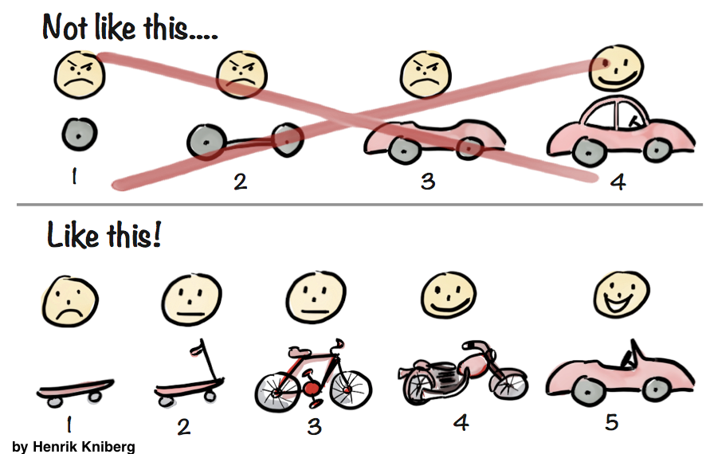

```{r, include=FALSE}
knitr::opts_chunk$set(
  echo = TRUE, message=FALSE, warning = FALSE, eval = FALSE, 
  fig.width = 16/2, fig.height = 9/2
)

# Set seed value of random number generator to get "replicable" random numbers.
# Why 76? Because of https://www.youtube.com/watch?v=xjJ7FheCkCU
set.seed(76)

# tidyverse R packages:
library(ggplot2)
library(dplyr)
library(tibble)
library(tidyr)
library(readr)
library(purrr)
library(forcats)
library(stringr)
library(lubridate)
library(forcats)
```

<!--
{target="_blank"}
-->

<style>
h1{font-weight: 400;}
</style>


***


# Midterm I {#midtermI}

## Administrative notes

* The exam periods are in the McConnell Hall Foyer this Friday 10/1 3:00-9:00 pm, Saturday 10/2 12:00-6:00 pm, and Sunday 10/3 12:00-6:00 pm.
* Read the "Basics" and "For Students" sections of the **new** [Fall 2021 Self Scheduled Exams instructions](https://www.science.smith.edu/self-scheduled-exam-printing/){target="_blank"}
* You are all subject to the [Smith Honor Code](https://www.smith.edu/about-smith/offices/student-affairs/student-handbook/academic-honor-code-0#:~:text=Honor%20Code%20Statement&text=Smith%20College%20expects%20all%20students,of%20course%20work%20and%20examinations.){target="_blank"}
* Notes for before exam:
    + Bring 3 colored pencils/pens.
    + Bring your Smith ID card
    + You do not need a calculator.
* Notes for during exam:
<!--    + Do not write your name on your exam, but rather your Smith ID number. This is for anonymous grading purposes. -->
    + Closed-book, no internet, and individually completed.
    + In case of potential errors or ambiguity on the exam, please note them, state your assumptions, and use your best judgement.
    + You will be given 140 mins to complete it (including transit time to writing areas), however I try to time it so that it will take much less than that. In other words, you should have plenty of time to complete it without rushing.
    + Timestamps will be strictly enforced. Any timestamps indicating than more than 140 minutes are subject to an honor board case. Those with ODS accommodations have the extended time specified in their ODS documentation letter. 


## Topics
    
* Topics: Lectures 1-10 inclusive (up to and including color theory in-class exercises).
* Join the `#midterms` channel on Slack and post all questions there
* What to study:
    + Lecture notes: both "chalk talk" and what's on webpage. 
    + Problem sets and solutions.
    + ModernDive readings and learning checks.
    + Practice midterm posted on `#midterms` channel on Slack, which we'll go over on Friday.
    


***


# Midterm II {#midtermII}

## Administrative notes

* The exam periods are in the McConnell Hall Foyer this Friday 11/5 3:00-9:00 pm, Saturday 11/6 12:00-6:00 pm, and Sunday 11/7 12:00-6:00 pm.
* Since midterm starts on Fri 3pm, I've instructed Spinelli tutors not to answer questions on Friday's 2:35-3:30pm session.
* Read the "Basics" and "For Students" sections of the **new** [Fall 2021 Self Scheduled Exams instructions](https://www.science.smith.edu/self-scheduled-exam-printing/){target="_blank"}
* You are all subject to the [Smith Honor Code](https://www.smith.edu/about-smith/offices/student-affairs/student-handbook/academic-honor-code-0#:~:text=Honor%20Code%20Statement&text=Smith%20College%20expects%20all%20students,of%20course%20work%20and%20examinations.){target="_blank"}
* Notes for before exam:
    + Bring 3 colored pencils/pens.
    + Bring your Smith ID card
    + You do not need a calculator.
* Notes for during exam:
    + Do not write your name on your exam, but rather your Smith ID number. This is for anonymous grading purposes.
    + Closed-book, no internet, and individually completed.
    + In case of potential errors or ambiguity on the exam, please note them, state your assumptions, and use your best judgement.
    + You will be given 140 mins to complete it (including transit time to writing areas), however I try to time it so that it will take much less than that. In other words, you should have plenty of time to complete it without rushing.
    + Timestamps will be strictly enforced. Any timestamps indicating than more than 140 minutes are subject an honor board case. Those with ODS accommodations have the extended time specified in their ODS documentation letter. 


## Topics
    
* Topics: 
    + Lecture 13-25: Data wrangling, "tidy" data, and importing data.
    + The midterm is not cumulative in that there are no direct questions from Lec 1-12, but you still need to know/understand topics from Midterm I because the materials build on top of each other. 
* What to study:
    1. Minimum viable product: Practice midterm
    1. Problem set solutions
    1. Chalk talk notes
    1. ModernDive Learning Check 3.20 on available seat miles (solutions in Appendix D): this is an all-encompassing problem that draws on nearly all the data wrangling verbs we've seen.
    1. ModernDive readings and learning checks: In particular the more theoretical ideas of "tidy" data.


```{r, echo = FALSE, eval = TRUE}

```    
