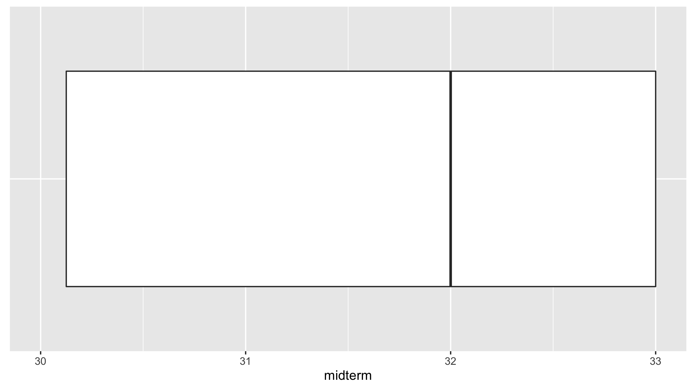
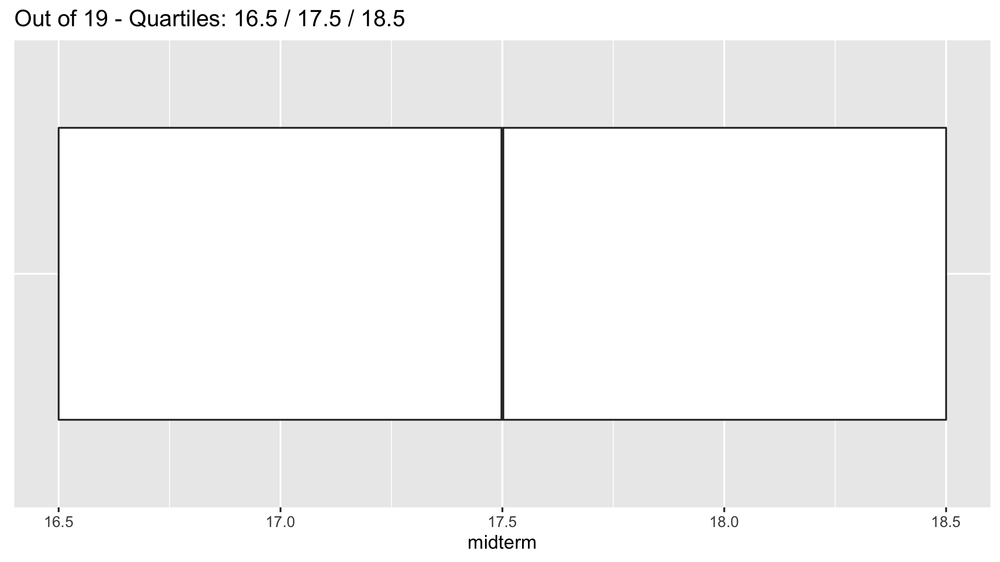

```{r, include=FALSE}
knitr::opts_chunk$set(
  echo = TRUE, message=FALSE, warning = FALSE, eval = FALSE, 
  fig.width = 16/2, fig.height = 9/2
)

# Set seed value of random number generator to get "replicable" random numbers.
# Why 76? Because of https://www.youtube.com/watch?v=xjJ7FheCkCU
set.seed(76)

# tidyverse R packages:
library(ggplot2)
library(dplyr)
library(tibble)
library(tidyr)
library(readr)
library(purrr)
library(forcats)
library(stringr)
library(lubridate)
library(forcats)
```

<!--
{target="_blank"}
-->

<style>
h1{font-weight: 400;}
</style>


***


# Midterm I {#midtermI}

## Administrative notes

* The exam periods are in the McConnell Hall Foyer this Friday 10/1 3:00-9:00 pm, Saturday 10/2 12:00-6:00 pm, and Sunday 10/3 12:00-6:00 pm.
* Read the "Basics" and "For Students" sections of the **new** [Fall 2021 Self Scheduled Exams instructions](https://www.science.smith.edu/self-scheduled-exam-printing/){target="_blank"}
* Notes for before exam:
    + Bring colored pencils/pens.
    + You do not need a calculator.
* Notes for during exam:
    + Closed-book, no internet, and individually completed.
    + In case of potential errors or ambiguity on the exam, please note them, state your assumptions, and use your best judgement.
    
<!--    
    + You will be given 140 mins to complete it (including transit time to writing areas), however I try to time it so that it will take much less than that. In other words, you should have plenty of time to complete it without rushing.
    + Timestamps will be strictly enforced. Any timestamps indicating than more than 140 minutes are subject to a 50% penalty and an honor board case. The only exceptions are those with ODS accommodations.
-->


## Topics
    
* Topics: Lectures 1-9 inclusive (up to and including color theory in-class exercises).
* What to study:
<!--    + Practice midterm posted on Slack. We'll go over them in Wednesday's lecture.-->
    + Lecture notes: both "chalk talk" and what's on webpage. 
    + Problem sets and solutions.
    + ModernDive readings and learning checks.
    


    
<!--

## Results

Boxplot of scores (out of 34) with no whiskers below. Quartiles were 30.12 / 32 / 33.

{ width=750px }

## Visualizations from midterm

Question 2.b):

```{r}
library(ggplot2)
library(dplyr)
example <- tibble(
  type = c("D", "B", "A", "C"), 
  fruit = c("apple", "apple", "orange", "orange"),
  city = c("Toronto", "Montreal", "Toronto", "Montreal"),
  number = c(3, 4, 2, 1)
)

ggplot(data = example, mapping = aes(x = type, y = number)) +
  geom_col() +
  labs(x = "Type", y = "Number")
```

Question 2.c):

```{r}
ggplot(data = example, mapping = aes(x = fruit)) +
  geom_bar() +
  labs(x = "Fruit", y = "Number")
```

Question 2.d):

```{r}
ggplot(data = example, mapping = aes(x = fruit, y = number, fill = city)) +
  geom_col(position = "dodge") +
  labs(x = "Fruit", y = "Number", fill = "City")
```

Question 3:

```{r, echo=FALSE}
prices <- c(-11, 12, 15, 20, 20, 
            30, 30, 30, 30, 40, 
            40, 40, 40, 41, 51)
tibble(prices = prices) %>% 
  ggplot(aes(x = "", y = prices)) +
  geom_boxplot() +
  coord_flip(ylim = c(-15, 60)) +
  labs(x = "", y = "price") +
  theme(axis.ticks = element_blank(), axis.text.y = element_blank()) + 
  scale_y_continuous(breaks = seq(-10, 50, by=10))
```

Question 4, modified to show difference in proportion

```{r, echo=FALSE}
library(babynames)
library(tidyr)
library(scales)

babynames_subset <- babynames %>%
  filter(name %in% c("Riley", "Casey")) %>% 
  pivot_wider(names_from = sex, values_from = prop) %>% 
  group_by(year, name) %>% 
  summarize(M = sum(M, na.rm=TRUE), F = sum(F, na.rm=TRUE)) %>% 
  mutate(diff = F - M)

ggplot(babynames_subset, aes(x=year, y=diff))  +
  geom_hline(yintercept = 0, linetype = "dashed") +
  geom_line() +
  facet_wrap(~name) +
  labs(x = "Year", y = "Female Prop - Male Prop", title = "Comparison of Casey and Riley")
```

-->


***


<!--
# Midterm II {#midtermII}

## Administrative notes

* **Friday 11/8 5pm through Sunday 11/10 11:55pm**. You must submit your midterm no later than Sunday at 11:55pm.
* Instructions on taking exams for [Smithies](https://sophia.smith.edu/edtech/documentation/print-an-exam-from-the-direct-to-queue-application/){target="_blank"} and [Five College Students](https://sophia.smith.edu/edtech/documentation/special-instructions-for-five-college-and-high-school-students-using-direct-to-queue-exam-printing/){target="_blank"}. **Print the exam in color.**

* Notes for before exam:
    + Link to print exam in the Seelye basement lab is posted on Moodle.
    + Bring colored pencils/pens.
    + You do not need a calculator.
    + Print exam in color.
* Notes for during exam:
    + Closed-book, no internet, and individually completed.
    + You will be given 140 mins to complete it (including transit time to writing area), however I try to time it so that it will take much less than that. In other words, you should have plenty of time to complete it without rushing.
    + **Timestamps will be strictly enforced. Any timestamps indicating than more than 140 minutes are subject to an honor board case and depending on decision a 50% penalty.**
    + In case of potential errors or ambiguity on the exam, please note them, state your assumptions, and use your best judgement.
* Notes for after exam:
    + Be sure to timestamp your exam before returning. 
    + Insert exam in appropriately labeled box in hallway.


## Topics
    
* Topics: 
    + Lecture 10-12. Last few topics on Data viz: Color theory, trend lines. **Added on 11/6**: No Shiny apps.
    + Lecture 14-20. Data wrangling, "tidy" data, and importing data.
* Themes:
    + The midterm is not "cummulative" in the sense that the focus will be on Lectures 10-20, but you still need to know/understand topics from Midterm I because the materials build on top of each other. 
    + Know how to write *pseudocode* like in the Available Seat Miles exercise in Lecture 19 on Wed 10/23. Click [here](https://twitter.com/rudeboybert/status/964181298691629056){target="_blank"} for examples. Pseudocode is both:
        + Just general enough to apply to any programming language/statistical software: R, python, SPSS, STATA, SAS, etc.
        + Just specific enough that the instructions are unambigious
    + Know the difference between these five joins: `left_join()`, `right_join()`, `inner_join()`, `full_join()`, and `anti_join()`. Go over the code examples on the course webpage for [Lec19](index.html#Lec19).
* What to study. Here is my suggested order:
    + Practice midterm posted on Slack under `#general_announcement`: this will give you a feel for the types of questions to expect.
    + Read chalk talk notes: they emphasize/summarize the most important ideas.
    + ModernDive Learning Check 3.20 on available seat miles (solutions in Appendix D): this is an all-encompassing problem that draws on nearly all the data wrangling verbs we've seen.
    + ModernDive readings and learning checks: In particular the more theoretical ideas of "tidy" data.
    + Problem sets 04 and 05


    
## Practice midterm notes

```{r}
library(fivethirtyeight)
library(nycflights13)
library(babynames)
```

### Question 1

```{r}
babynames
```


### Question 2

```{r}
nrow(weather)
```


### Question 4

Based on [Dear Mona Followup: Where Do People Drink The Most Beer, Wine And Spirits?](https://fivethirtyeight.com/features/dear-mona-followup-where-do-people-drink-the-most-beer-wine-and-spirits/){target="_blank"}.

```{r}
# drinks is not "tidy"
drinks

drinks_tidy <- drinks %>%
  # Convert to "tidy"
  pivot_longer(cols = ends_with("servings"), names_to = "type", values_to = "servings") %>%
  # Do text manipulation: only characters 1 thru 10. this trims off "_servings"
  mutate(type = str_sub(type, start=1, end=-10)) %>%
  arrange(country, type)
drinks_tidy

ggplot(drinks_tidy, aes(x = type, y = servings)) +
  geom_boxplot() +
  labs(x = "Alcohol type", y = "Number of servings")
```


### Question 6

You are presented with data on the Titanic disaster of 1912 in a data frame `Titanic`, which cross-classifies survival vs death by class, sex, and age. Write down the *pseudocode* of the commands that will output a table comparing survival vs death counts for the following three scenarios:

* by sex
* by sex and class and age
* to answer the question if the "women and children"-first policy of the White Star Line Company (the company that ran the Titanic) held true or not.

Note: you don't need to calculate the output table, just write the pseudocode that would produce it where the more concise the pseudocode the better. Here is what the `Titanic` data looks like:\\

```{r}
data(Titanic)
# Convert to tibble i.e. data frame
Titanic <- Titanic %>% 
  as_tibble()

Titanic
```

#### Solutions

The key thing to note here is that the different combinations of `Class`, `Sex`, `Age`, and `Survived` are *pre-counted* in the `n` variable. Thus the `Titanic` data frame has only 32 rows. This is different than the `titanic` data frame from [PS05 Question 2](static/PS/PS05_solutions.html){target="_blank"} that has 2201 rows: one for each passenger.

So the data wrangling is a little different! Here we must `sum(n)` whereas in PS05 we used the `n()` summary function to count rows. 


**Part a)**: by sex
```{r}
Titanic %>% 
  group_by(Sex, Survived) %>% 
  summarize(n = sum(n))
```

**Part b)**: by sex, age, and class

Nothing to do! We already have `Survived` (`"No"` vs `"Yes"`) counts split by these categories!

**Part c)**: In retrospect this question is much harder than you can expect on the midterm. However if you're curious:

First we need to have `Survived` (`"No"` vs `"Yes"`) counts for each `Sex` and `Age` combinations:

```{r}
Titanic %>% 
  group_by(Sex, Age, Survived) %>% 
  summarize(n = sum(n))
```

Next we need to identify the "women and children"

```{r}
Titanic %>% 
  group_by(Sex, Age, Survived) %>% 
  summarize(n = sum(n)) %>% 
  # Identify "women and children". Shout out to Adriana B. for suggesting this step to me!
  mutate(w_or_c = Sex == "Female" | Age == "Child")
```

Next `group_by()` this new variable and get the sum of `n`

```{r}
Titanic %>% 
  group_by(Sex, Age, Survived) %>% 
  summarize(n = sum(n)) %>% 
  # Identify "women and children". Shout out to Adriana B. for suggesting this step to me!
  mutate(w_or_c = Sex == "Female" | Age == "Child") %>% 
  # Get counts for "women and children":
  group_by(w_or_c, Survived) %>% 
  summarize(n = sum(n))
```

Next compute the proportions. We haven't done this much in class, but if you look in [tips and tricks](tips_and_tricks.html#prop), you'll see this is one of the rare cases we use `group_by()`, but not followed by a `summarize()` but a `mutate()` instead:

```{r}
Titanic %>% 
  group_by(Sex, Age, Survived) %>% 
  summarize(n = sum(n)) %>% 
  # Identify "women and children". Shout out to Adriana B. for suggesting this step to me!
  mutate(w_or_c = Sex == "Female" | Age == "Child") %>% 
  # Get counts for "women and children":
  group_by(w_or_c, Survived) %>% 
  summarize(n = sum(n)) %>% 
  # Compute proportions:
  group_by(w_or_c) %>% 
  mutate(
    total = sum(n),
    prop = n/total
  )
```

Lastly, to make things easier to look at, let's only look at `Survived` equals `"Yes"`

```{r}
Titanic %>% 
  group_by(Sex, Age, Survived) %>% 
  summarize(n = sum(n)) %>% 
  # Identify "women and children". Shout out to Adriana B. for suggesting this step to me!
  mutate(w_or_c = Sex == "Female" | Age == "Child") %>% 
  # Get counts for "women and children":
  group_by(w_or_c, Survived) %>% 
  summarize(n = sum(n)) %>% 
  
  # Compute proportions:
  group_by(w_or_c) %>% 
  mutate(
    total = sum(n),
    prop = n/total
  ) %>% 
  # Only survived:
  filter(Survived == "Yes")
```

So yes, it seems "women and children first" did hold as seen by the 69.9% vs 20.3%.


## Results

Boxplot of scores with no whiskers below.

{ width=750px }


## Source for Questions

* Q1: Code from [Lec10](index.html#Lec10){target="_blank"} on color theory and [ModernDive 2.8.3](https://moderndive.netlify.com/2-viz.html#two-categ-barplot){target="_blank"} on `fill` aesthetic for barplots
* Q2: [ModernDive 4.2.1](https://moderndive.netlify.com/4-tidy.html#tidy-definition){target="_blank"} on "tidy" data
* Q3: [PS05 - Q1.a)](static/PS/PS05_solutions.html){target="_blank"}
* Q4: Code from [Lec19](index.html#Lec19){target="_blank"} on joins
* Q5: Practice Midterm II with a few variations

--> 
