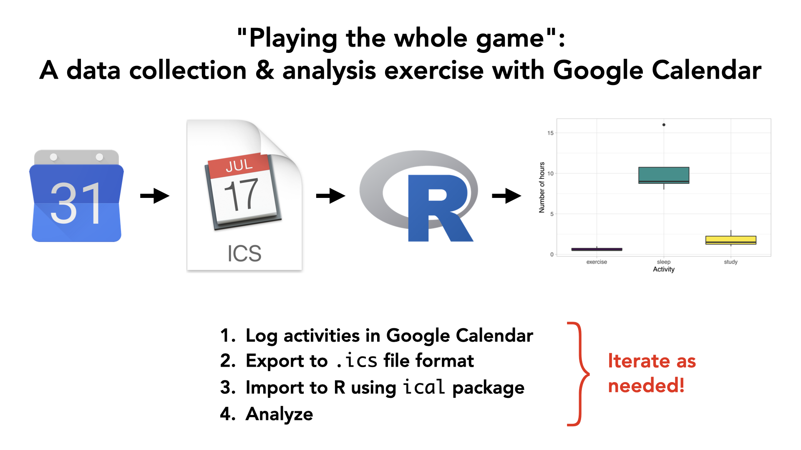
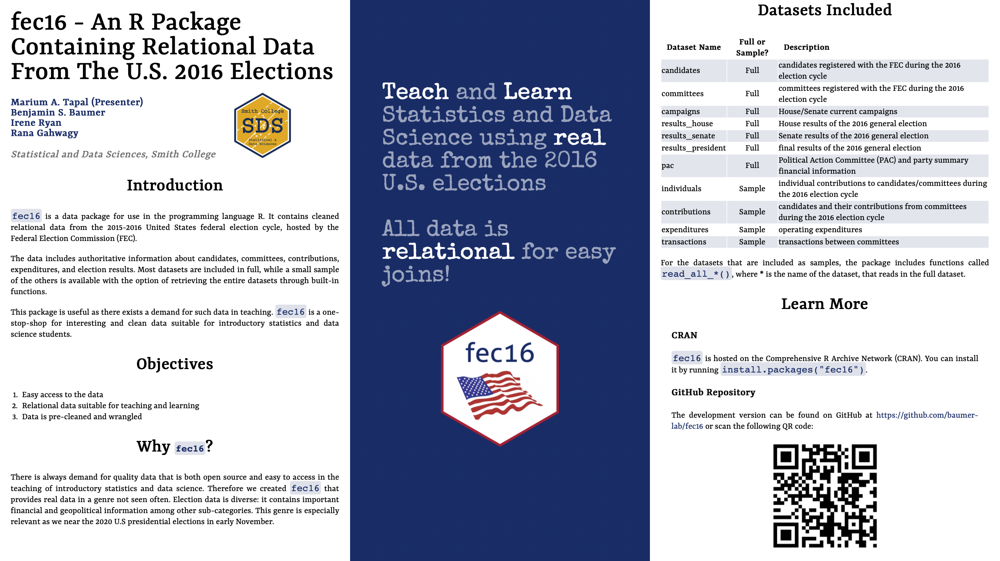
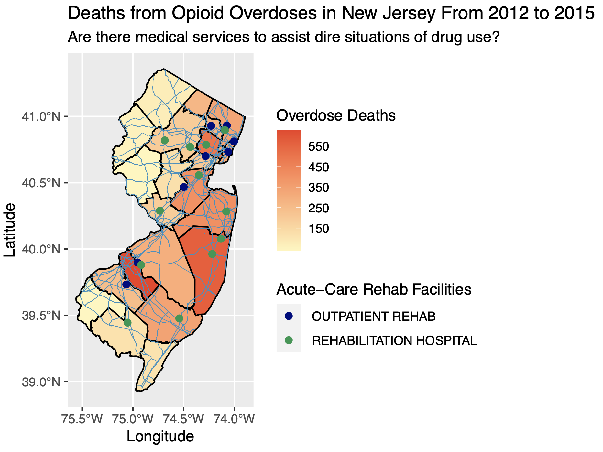

```{r, include=FALSE}
library(knitr)
opts_chunk$set(
  echo = TRUE, message=FALSE, warning = FALSE, eval = FALSE, 
  fig.width = 16/2, fig.height = 9/2, fig.align="center"
)

# Set seed value of random number generator to get "replicable" random numbers.
# Why 76? Because of https://www.youtube.com/watch?v=xjJ7FheCkCU
set.seed(76)
```

<!--
{target="_blank"}
-->

<style>
h1{font-weight: 400;}
</style>


# Extension Requests

* You have an extension "budget" of a maximum of 5 days for the rest of the semester; it's up to you to keep track of your budget
* Request must be made before due date/time.
* [Google Form](https://docs.google.com/forms/d/e/1FAIpQLSeCrhqs-iTD5qPcf4FfcFNHE_rwMuaeF37yQuwusRsP9xHJ_Q/viewform){target="_blank"}


***


# Mini-Project 1 {#MP1}

<!--

READ THIS

- Many students are having trouble loading their .ics calendar files into R b/c of filepaths. Please strongly encourage them to create a MP1 folder somewhere, put the MP1.Rmd and .ics file in the same directory, and have them load it in R NOT by using filepaths but rather using RMarkdown's default assumption that the .ics file is in the same directory. i.e. do "192.ics" %>% ical_parse_df() and not "~/Downloads/SDS192/MP1/192.ics %>% ical_parse_df()
- Some students are exporting blank calendars. If the above doesn't work, have them verify using the Google Calendar online interface that there are actually more than 0 calendar entries recorded
Windows users need to explicitly click "Extract All" when trying to unzip the MP1.zip file. Unlike macOS, double-clicking it only allows the user to view its contents; Windows users need to explicitly "extract all" to have an MP1 folder get created on their computer.
- Depending on the operating system, then calendar_data data frame might record minutes as seconds. Throw a mutate(minutes = minutes/60) %>% in there to fix that
- Tricky one: If a student recorded a calendar entry on a "repeat" schedule, only the first entry will get exported to .ics ; for purposes of this MP1 they need to create individual entries for all to export correctly (see my message in mp1 for a lengthier explanation)
- If you're still stuck, don't stress, and have the student message me. I'll take care of clean-up

Things to remember for next time:

- Add grading rubric
- When calendar entries are set to "repeat" only the first entry shows up
- Issue with time intervals being imported in seconds, minutes, hours, 

-->

*Due Wednesday 10/13 at 9pm.*

```{r, echo = FALSE, eval = TRUE}

```


## Basic outline

1. Identify a question about how you use your time *that you feel comfortable sharing with your partner and me*.
1. Start the data collection process: start logging time in Google Calendar, macOS Calendar, or Outlook.
1. Export the calendar to `.ics` file format and then import into R.
    + The screencast demonstrates how to do this with Google Calendar. 
    + Test this early and test this often!
1. Exchange data! You will pass your question and data to your partner, and they will do an analysis with two non-redundant data visualizations.
1. Write a joint reflection piece on this experience. In particular
    + As someone who provides data: What expectations do you have when you give your data?
    + As someone who analyzes other people's data: What legal and ethical responsibilities do you have?
    + The joint reflection piece should be of no more than 500 words.

<center>    
<iframe width="560" height="315" src="https://www.youtube.com/embed/vLlR4lBWAoc" frameborder="0" allow="accelerometer; autoplay; encrypted-media; gyroscope; picture-in-picture" allowfullscreen></iframe>
</center> 


## Steps

### 1. Getting started

* Find your group in the `#mp1` channel. Please identify:
    + Your group number
    + Who your group leader is: whoever in your group is listed as `member_1`
* Download <a href="static/projects/MP1/MP1.zip" download>`MP1.zip`</a> and double-click it to "unzip" it
* Knit the `MP1.Rmd` file once and read it over
* Group leader only:
    + Open the template joint reflection piece [Google Doc](https://docs.google.com/document/d/1brhEHGmRRam5SA23O6cH3ZZN7CrShDv5bt6nbZ5zPT0/edit?usp=sharing){target="_blank"}
    + Go to File (next to blue Google Doc icon) -> Make a copy
    + Share it with your partner so that you can both edit it


### 2. Suggestion: Complete your Minimally Viable Product

```{r, echo = FALSE, eval = TRUE}
include_graphics("static/images/MVP_2.png")
```

IMO when working on any project

* Don't try to do everything completely and perfectly from the beginning. This leads to perfectionist thinking, which leads to procrastination and "analysis paralysis."
* Do start by finishing a [minimially viable product](https://www.forbes.com/sites/quora/2018/02/27/what-is-a-minimum-viable-product-and-why-do-companies-need-them/#178bd8a2382c){target="_blank"} (image 1 in the bottom row of the image above). In other words:
    + [Done is better than perfect](https://lifehacker.com/done-is-better-than-perfect-5870379){target="_blank"}
    + [Don't let perfect be the enemy of good](https://www.huffpost.com/entry/dont-let-the-perfect-be-t_b_158673){target="_blank"}
* Once you're done your MVP, gather feedback on how your project works. Based on this feedback, then iterate and improve.


### 3. Submit three things

There are three components to your grade:

1. Both group members: Submit the `MP1.pdf` of your analysis of your partner's question on gradescope.
1. Both group members: Fill out the peer evaluation [Google Form](https://docs.google.com/forms/d/e/1FAIpQLSd6w4CC9-PrWrpupNfosQUBVoCWBihRwdezYb2jJEj7-kNdfg/viewform){target="_blank"}
1. Group leader only: Submit a PDF of your joint reflection piece on gradescope


### 4. Grades

On Moodle where

1. Analysis (gradescope):
    + Viz 1: 35%
    + Viz 2: 35%
1. Joint reflection piece (gradescope): 25%
1. Peer evaluation (Google Form): 5%


## Details

- Has to involve intervals of time: a start time and end time. For example, not "I went to sleep at." but "I slept during these times."
- Enter in at least two types of activities in your calendar. This activity type becomes the summary categorical variable
with two levels.
- How long does the analysis need to be? No firm rule, but think: if there are two equally insightful reports, one is 20 pages and the other is 2 pages. which will you read? Or think when you visit a webpage. How long does it take you to decide if you're going to read it.
- Graphs can't be redundant: Think in terms of ink/information ratio: if the graphs are very redundant, then why not show just one?
- How many much analysis? 5 sentences or less for analysis of each graph.
- You need to collect at least 10 days worth of data


***


# Mini-Project 2 {#MP2}

<!--
Things to remember for next time:

- 24A vs 24E transaction_typ varible
- Make sure .Rproj file has save .Rdata and .Rhistory set to FALSE b/c fec16 package data is huge
- Look at current and past fec16 package issues here: https://github.com/baumer-lab/fec16/issues, especially
    + SSL errors
    + Some datasets are just too huge
-->


*Due Monday 11/1 at 9pm.*

Words of wisdom from Detective Lester Freamon from The Wire:

<center>
<iframe width="560" height="315" src="https://www.youtube.com/embed/Z7M71wmwWRo" title="YouTube video player" frameborder="0" allow="accelerometer; autoplay; clipboard-write; encrypted-media; gyroscope; picture-in-picture" allowfullscreen></iframe>
</center>

## Basic outline

The theme of your analysis will be **follow the money** as quoted in the video above. You will work with a partner to analyze Federal Election Commission data based on the 2016 federal election cycle, as provided by the Federal Election Commission. We'll be accessing this data in the `fec16` package, which was developed by Prof Ben Baumer, Rana Gahwagy, Irene Ryan, and Marium A. Tapal from Smith College. Check out Marium's poster from the [Women in Statistics and Data Science 2020 conference](https://ww2.amstat.org/meetings/wsds/2020/onlineprogram/AbstractDetails.cfm?AbstractID=309585){target="_blank"}:  


```{r, echo = FALSE, eval = TRUE}

```

Here are two **randomly** chosen examples to give a **qualitative** sense of the outcome, there are many ways to do this project.

* [Example 1](static/projects/MP2/MP2_example_1.html){target="_blank"}
* [Example 2](static/projects/MP2/MP2_example_2.html){target="_blank"}


## Steps


### 1. Getting started

* Find your group in the `#mp2` channel. Please identify:
    + Your group number
    + Who your group leader is: whoever in your group is listed as `member_1`
* Download <a href="static/projects/MP2/MP2.Rmd" download>`MP2.Rmd`</a>
* Knit the `MP2.Rmd` file once and read it over
* Read the `fec16` [poster](static/projects/MP2/fec16.pdf){target="_blank"} Marium Tapal presented to get an overview of the package, especially the datasets: some include full data by default, others only include a sample for which if you want full data you need to download it from the web (this is because R packages have file size restrictions). See code below.
* This is A LOT of data; it will be easy to get lost
    + `View()` is your best friend: simply looking at your data is so powerful, but also a step that's so easily neglected
    + Read the help files for documentation: Know what all the variables mean, and what the values mean.
    + Start simple: Get that minimally viable first visualization done, then iteratively add complexity. 

```{r, eval = FALSE}
library(fec16)

# Look at help file
?contributions

# By default the contributions data frame only contains the first 1000 rows:
contributions

# Download full contributions data from web and overwrite contributions using:
# read_all_*() function.
# You will need to install the usethis package for this line of code to work
contributions <- read_all_contributions()

# Now contributions has full 516,394 rows
contributions
```
  

### 2. Grading

1. **Baseline:** Projects that do not satisfy all "baseline" criteria can expect to get a grade of less than 7/10.
    + All visualizations have appropriately labeled axes, legends, titles, etc. Such information gives the data's context.
    + All visualizations are mindful of the [ink/information ratio](https://medium.com/@sudharsanasai/declutter-your-chart-with-data-ink-ratio-6f6908727842){target="_blank"}.
    + All code must be visible in your PDF.
    + Citations must be included as footnotes.
1. **Minimally viable product:** Grade 7/10
    + Satisfy all "baseline" criteria.
    + Create one data visualization that "follows the money" i.e. involves campaign contributions and include a written analysis.
1. **Due diligence:** Grade 8/10
    + Satisfy all "baseline" and "minimally viable product" criteria.
    + The data visualization from the "minimally viable product" should be based on at least two joined data frames. 
1. **Point of diminishing returns:** Grade 9/10
    + Satisfy all "baseline", "minimally viable product", and "due diligence" criteria.
    + Create a second data visualization that builds on the first data visualization, but is also non-redundant to the first. Include a written analysis.
1. **Polishing the cannonball** Grade >9/10
    + Satisfy all "baseline", "minimally viable product", "due diligence", and "point of diminishing returns" criteria.
    + Written text does an exceptional job of not only addressing what money-driven effect on politics is being observed, but also attempts to address *why* this money-driven effect on politics is happening.


### 3. What to submit

There are two components to your grade:

1. Group leader only: Submit the `MP2.pdf` of your analysis on gradescope
1. Both group members: Fill out the peer evaluation [Google Form](https://docs.google.com/forms/d/e/1FAIpQLSeqF7w2Hb1o4e08oYSbndefg3kqHetKL-wLirhUMrfE7sYRuQ/viewform){target="_blank"}


***


# Mini-Project 3 {#MP3}

<!--
Things to remember for next time:
- Contact Smith Spatial Lab MUCH EARLIER
- Give example of joining sf object with data frame in examples.Rmd to create choropleth map of external variable
-->

*Due Tuesday ~~11/23~~ 11/30 (after break) at 9pm.* 

```{r, echo = FALSE, eval = TRUE}

```

*Example map courtesy Brianna Mateo and Michel Ruiz Fuentes*

## Basic outline

Create maps using the `sf` package. Here are two **randomly** chosen examples to give a **qualitative** sense of the outcome. 

* [Example 1](static/projects/MP3/MP3_example_1.html){target="_blank"}
* [Example 2](static/projects/MP3/MP3_example_2.html){target="_blank"}

Note you do not need to submit a interactive map, just a static (non-interactive) map generated with the `sf` package. If you would like to learn how to make interactive maps on your own, check out the [`leaflet` package](https://rstudio.github.io/leaflet/){target="_blank"}.

## Steps

### 1. Getting started

* Find your group in the `#mp3` channel. Please identify:
    + Your group number
    + Designate a group leader.
* Add the following to the folder that has your `MP3.Rproj` RStudio Project you created in [Lec26](index.html#Lec26):
    + Download <a href="static/projects/MP3/MP3.Rmd" download>`MP3.Rmd`</a> and add it to the above folder
    + In the above folder create a new directory called `data/`
    + Download <a href="static/projects/MP3/ma_cities.csv" download>`ma_cities.csv`</a> and add it to the `data/` folder
* Knit the `MP3.Rmd` file once and read it over
* Map making can get very complicated, so start simple. Get that minimally viable first visualization done, then iteratively add complexity. 

```{r, echo = FALSE, eval = TRUE}
include_graphics("static/images/MVP_2.png")
```


### 2. Grading

1. **Baseline:** Projects that do not satisfy all "baseline" criteria can expect to get a grade of less than 8/10.
    + **This will be strictly evaluated**: The `MP3.Rmd` R Markdown file must "knit" correctly when *someone else* knits it. This is known as producing *reproducible research*.
    + Wherever possible, all maps have appropriately labeled axes, legends, and titles and all maps are mindful of the [ink/information ratio](https://medium.com/@sudharsanasai/declutter-your-chart-with-data-ink-ratio-6f6908727842){target="_blank"}.
    + From the report reader's perspective, there should be no "superfluous" and non-informative output (e.g. instructions text). You must be empathetic to your reader, or your reader will just throw your report in the trash. 
    + You submit your peer evaluation.
1. **Minimally viable product:** Grade: 8/10.
    + Satisfy all "baseline" criteria.
    + Include any map generated by the `sf` package.
1. **Due diligence:** Grade: 9/10.
    + Satisfy all "baseline" and "minimally viable product" criteria.
    + Add to the map by layering points on top of it. The points
        + Need to be imported from an external `.csv` file that you will find  (cite source).
        + Need to overlap the map.
1. **Point of diminishing returns:** Grade: 10/10.
    + Satisfy all "baseline", "minimally viable product", and "due diligence" criteria.
    + Add to the map by also layering data from a shapefile on it. This shapefile data
        + Needs to be imported data from a shapefile you will find (cite source). 
        + Can be points, lines, or polygons.
        + Need to overlap the map.


### 3. What to submit

There are two components to your grade:

1. Group leader only: Submit the `MP3.zip` file of your entire RStudio Project folder on [moodle](https://moodle.smith.edu/course/view.php?id=42274){target="_blank"}.
1. Both group members: Fill out the peer evaluation [Google Form](https://docs.google.com/forms/d/e/1FAIpQLSdf2M_0oYOR8hwUgxoQFeMR5bKvz4FMZs7Z4k1L1uOy3e_dQw/viewform){target="_blank"}


***


# Final Project {#Final}

*Assigned on Wed Dec 1, due Fri 12/17 at 2pm ~~9pm~~.*

## Basic outline

Using an R Markdown website you will answer any scientific question of your choosing using data:

* Your website must at least have the following two pages:
    + An intro `index.html` page in blog-post style that summarizes your work. It should have
        1. One visualization that best summarizes your work.
        1. No more than 200 words of text
    + A second `more_info.html` page going more in-depth for people who want more details. In should have
        1. Between 2-3 more visualizations.
        1. No more than 500 words of text
* Publishing to the web: 
    + If your data/analysis is not sensitive or private in nature, publish your R Markdown Website using Netlify Drop
    + If your data/analysis is sensitive or private in nature, please DM me on Slack and we'll work something out.

Here are some arbitrarily chosen examples. Note the topics covered this semester have shifted. 

1. [America’s Leaky Pipes: The Environmental Impact of Oil Pipeline Spills](https://ctimmons1.github.io/webpage/index.html){target="_blank"}
1. [💵The Gigantic Gender Pay Gap💵](https://estherrose21.github.io/webpage/index.html){target="_blank"}
1. [Putting Food on the Table in 50 States](https://jcflohr.github.io/final-project/index.html){target="_blank"}
1. [Who Are The Noisemakers? | Analyzing the Loudest Parties in NYC](https://lepidopterane-atsmith.github.io/sds192fp/index.html){target="_blank"}
1. [Bigfoot: True or Real?](https://loblatt.github.io/final_project_webpage/index.html){target="_blank"}


## Getting started

1. Join `#final_project` Slack channel
1. Create groups of 2-3 students from any section and post in Google Sheet in `#final_project` channel in Slack
1. Finding data. This is often the hardest part of such projects and I suggest you **do this as soon as possible**
    + Ideally, determine a research question you are interested in. Then find this data.
    + Often however you can't find data that answers your desired question, but rather only some modified form of your question. This is fine, done is better than perfect.
    + If you are still stuck, find data first and then reverse-engineer a question. Not ideal, but again, done is better than perfect.
    + Use Smith College data resources. In particular:
        + The Spinelli Center [Data Research and Statistics Counselor](https://www.smith.edu/qlc/tutoring.html?colDataCnslr=open#PanelDataCnslr){target="_blank"} Osman Keshawarz
        + The [Spatial Analysis Lab](http://www.science.smith.edu/sal/){target="_blank"}
1. Setup the Final Project RStudio Project
    1. Download the following zip file: <a href="static/projects/final_project.zip" download>`final_project.zip`</a>
    1. Move `final_project.zip` to your SDS192 folder on your computer
    1. Unzip `final_project.zip`. Windows users: be sure to "Extract all"
    1. In the resulting `final_project` folder, double-click the RStudio Project `final_project.Rproj` icon to open in RStudio Project mode


## Submitting the project

1. Group leader only: Submit a `final_project.zip` file of your entire RStudio Project folder on [moodle](https://moodle.smith.edu/course/view.php?id=42274){target="_blank"}.
1. All group members:
    + Fill out the peer evaluation [Google Form](https://docs.google.com/forms/d/e/1FAIpQLSegFq2mD2-twioEq3aniLRnAJQR90vJuKY1VJzN3_ZP0KGQ3g/viewform){target="_blank"}. Note you will need the Netlify Drop URL of the website you deployed on the web (unless your project involves sensitive non-public data).
    + Fill out [exit survey](https://docs.google.com/forms/d/e/1FAIpQLSdcVrUjjPEAM587UKIG_T7Nv7vsb351lcWL8SLZUw3qJ9UWAA/closedform){target="_blank"} Google Form


## Grading rubric

1. **Baseline:** Projects that do not satisfy all "baseline" criteria can expect to get a grade of less than 8/10.
    + The RMarkdown Website must "build" correctly when someone else builds it. *This is known as producing reproducible research.*
    + Wherever possible, all visualizations have appropriately labeled axes, legends, titles, etc and are mindful of the [ink/information ratio](https://medium.com/@sudharsanasai/declutter-your-chart-with-data-ink-ratio-6f6908727842){target="_blank"}.    
    + Your code is clean, commented, and well-indented.
    + From the perspective of both the report reader and potential collaborators who might reproduce your work, no "superfluous" and non-informative inputs or outputs are included. *This is being mindful of the work you create for readers and collaborators, including future you.* Ex: Do not
        1. Include my original instructions in the report.
        1. Include "Data dumps" like showing all the contents of a 1000 row data frame.
        1. Submit files in your RStudio Project folder that aren't relevant to your analysis. 
    + All accompanying write-ups are coherent and respect the word count limit.
    + You submit both your peer evaluations and your exit survey responses.
1. **Minimally viable product:** Grade: 8/10.
    + Satisfy all "baseline" criteria.
    + Complete the intro `index.html` blog-post page.
1. **Due diligence:** Grade: 9/10.
    + Satisfy all "baseline" and "minimally viable product" criteria.
    + Complete the second `more_info.html` page with 1 visualization.
1. **Point of diminishing returns:** Grade: 9.5/10.
    + Satisfy all "baseline", "minimally viable product", and "due diligence" criteria.
    + Complete the second `more_info.html` page with 2-3 visualizations.
1. **Polishing the cannonball**: Grade: 10/10
    + Satisfy all "baseline", "minimally viable product", "due diligence", and "point of diminishing returns" criteria.
    + Impress me by using the tools you've learned this semester. Yes, this criteria is deliberately vague. 


