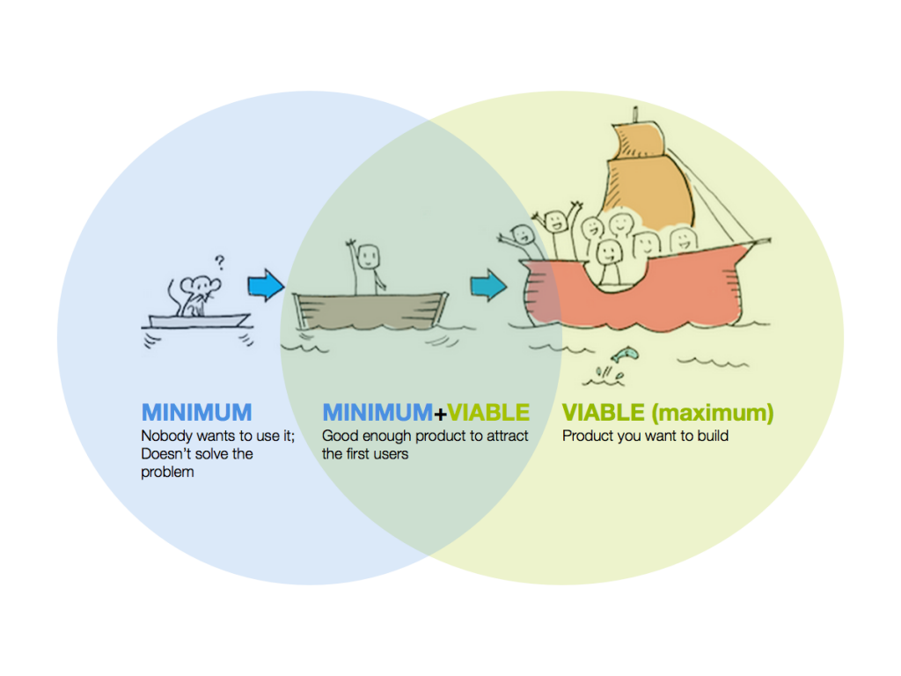

```{r, include=FALSE}
knitr::opts_chunk$set(
  echo = TRUE, message=FALSE, warning = FALSE, eval = TRUE, 
  fig.width = 16/2, fig.height = 9/2
)

# Set seed value of random number generator to get "replicable" random numbers.
# Why 76? Because of https://www.youtube.com/watch?v=xjJ7FheCkCU
set.seed(76)
```

<!--
{target="_blank"}
-->

<style>
h1{font-weight: 400;}
</style>


Everything in this course builds up to the final group project, where there is
only one learning goal: *Engage in the data/science research pipeline in as
faithful a manner as possible while maintaining a level suitable for novices.* To get practice however there will be 3 mini-projects first.

<center>

</center>


***

<!--
- Has to involve intervals of time: a start time and end time. For example, not "I went to sleep at." but "I slept during these times."
- Add grading rubric
- How long does the analysis need to be? No firm rule, but think: if there are two equally insightful reports, one is 20 pages and the other is 2 pages. which will you read? Or think when you visit a webpage. How long does it take you to decide if you're going to read it.
- Graphs can't be redundant: Think in terms of ink/information ratio. 5 sentences or less for analysis of each graph.
- When calendar entries are set to "repeat" only the first entry shows up
- Enter in at least two types of activities in calendar. this becomes the summary categorical variable
with two levels.
- In reflection piece: tie in with podcast. difficulty of collecting data. 
- Issue with time intervals being imported in seconds, minutes, hours, 
-->

# Mini-Project 1 {#MP1}

*Partially assigned on Friday 9/27, completely assigned on Monday 9/30, due Friday 10/11 at 5pm.*

Basic outline:

1. Identify a question about how you use your time *that you feel comfortable sharing with your partner and me*.
1. Start the data collection process: start logging time in Google Calendar, macOS Calendar, and Outlook.
1. Import the calendar data into R. Do this early, do this often!
1. Exchange data! You will pass your question and data to your partner, and they will do an analysis by creating two data visualizations.
1. Write a joint reflection piece on this experience, keeping the podcast in mind. In particular
    + As someone who provides data: What expectations do you have when you give your data?
    + As someone who analyzes other's data: What legal and ethical responsibilites do you have?
    + The joint reflection piece should be of no more than 500 words. I suggest you write it in Google Docs and then export to PDF.
    
The following screencast illustrates Steps 2 and 3 above:

<iframe width="560" height="315" src="https://www.youtube.com/embed/vLlR4lBWAoc" frameborder="0" allow="accelerometer; autoplay; encrypted-media; gyroscope; picture-in-picture" allowfullscreen></iframe>


## Step 0: Identify groups

* Look in Slack in `#mp1` channel to see your group, your group number, and who your group leader is.

## Step 1: Download starter code

* Download <a href="static/MP1.zip" download>`MP1.zip`</a> and double-click it to "unzip" it
* Rename the `MP1_lastname_firstname.Rmd` file to have your last and first name
* Knit the `.Rmd` file once and read it over
* Create two data visualizations and provide an analysis to answer your partner's question

## Step 2: Submit

1. Everyone: Submit the following three files on Moodle:
    a) The `.ics` calendar file with your partner's calendar data. **Added 9/30:** You should both be logging calendar data until Wed 10/9.
    a) The `.Rmd` R Markdown file analyzing your partner's calendar data.
    a) The `.html` output file
1. Everyone: Fill out the peer evaluation [Google Form](https://docs.google.com/forms/d/e/1FAIpQLSdINjxeoi0bCsicx8SfcLkjV2V0j4XgMB959oQ5q2GVIhthjg/viewform){target="_blank"}
1. Group leader only: PDF of 500 word joint reflection piece.


## Tip: Minimally viable product

When building a product, IMO:

**Don't**: Try to do everything completely and perfectly from the beginning. This leads to perfectionist thinking, which leads to procrastination and "analysis paralysis".

**Do**: Start by finishing a [minimially viable product](https://www.forbes.com/sites/quora/2018/02/27/what-is-a-minimum-viable-product-and-why-do-companies-need-them/#178bd8a2382c){target="_blank"} FAST:

<center>
{ width=525px }
</center>

Only you're done your MVP, iterate and improve by adding complexity.

**In other words**:

* [Done is better than perfect](https://lifehacker.com/done-is-better-than-perfect-5870379){target="_blank"}
* [Don't let the perfect be the enemy of the good](https://www.huffpost.com/entry/dont-let-the-perfect-be-t_b_158673){target="_blank"}
* [Think big, start small](https://www.forbes.com/sites/chunkamui/2016/01/03/6-words/#15457a371a3b){target="_blank"}


***


# Mini-Project 2 {#MP2}

*Assigned on Friday 10/18, due Friday 11/1 at 5pm.*

Basic outline:
