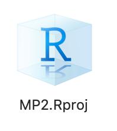
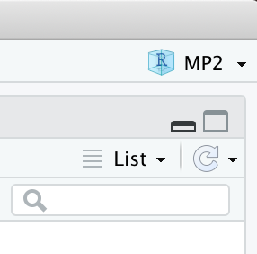

```{r, include=FALSE}
library(knitr)
opts_chunk$set(
  echo = TRUE, message=FALSE, warning = FALSE, eval = FALSE, 
  fig.width = 16/2, fig.height = 9/2, fig.align="center"
)

# Set seed value of random number generator to get "replicable" random numbers.
# Why 76? Because of https://www.youtube.com/watch?v=xjJ7FheCkCU
set.seed(76)
```

<!--
{target="_blank"}
-->

<style>
h1{font-weight: 400;}
</style>


# Mini-Project 1 {#MP1}

<!--

READ THIS

- Many students are having trouble loading their .ics calendar files into R b/c of filepaths. Please strongly encourage them to create a MP1 folder somewhere, put the MP1.Rmd and .ics file in the same directory, and have them load it in R NOT by using filepaths but rather using RMarkdown's default assumption that the .ics file is in the same directory. i.e. do "192.ics" %>% ical_parse_df() and not "~/Downloads/SDS192/MP1/192.ics %>% ical_parse_df()
- Some students are exporting blank calendars. If the above doesn't work, have them verify using the Google Calendar online interface that there are actually more than 0 calendar entries recorded
Windows users need to explicitly click "Extract All" when trying to unzip the MP1.zip file. Unlike macOS, double-clicking it only allows the user to view its contents; Windows users need to explicitly "extract all" to have an MP1 folder get created on their computer.
- Depending on the operating system, then calendar_data data frame might record minutes as seconds. Throw a mutate(minutes = minutes/60) %>% in there to fix that
- Tricky one: If a student recorded a calendar entry on a "repeat" schedule, only the first entry will get exported to .ics ; for purposes of this MP1 they need to create individual entries for all to export correctly (see my message in mp1 for a lengthier explanation)
- If you're still stuck, don't stress, and have the student message me. I'll take care of clean-up

Things to remember for next time:

- Add grading rubric
- When calendar entries are set to "repeat" only the first entry shows up
- Issue with time intervals being imported in seconds, minutes, hours, 

-->

*Due Wednesday 10/13 at 9pm.*

```{r, echo = FALSE, eval = TRUE}
include_graphics("static/images/google_calendar.png")
```


## Basic outline

1. Identify a question about how you use your time *that you feel comfortable sharing with your partner and me*.
1. Start the data collection process: start logging time in Google Calendar, macOS Calendar, or Outlook.
1. Export the calendar to `.ics` file format and then import into R.
    + The screencast demonstrates how to do this with Google Calendar. 
    + Test this early and test this often!
1. Exchange data! You will pass your question and data to your partner, and they will do an analysis with two non-redundant data visualizations.
1. Write a joint reflection piece on this experience. In particular
    + As someone who provides data: What expectations do you have when you give your data?
    + As someone who analyzes other people's data: What legal and ethical responsibilities do you have?
    + The joint reflection piece should be of no more than 500 words.

<center>    
<iframe width="560" height="315" src="https://www.youtube.com/embed/vLlR4lBWAoc" frameborder="0" allow="accelerometer; autoplay; encrypted-media; gyroscope; picture-in-picture" allowfullscreen></iframe>
</center> 


## Steps

### 1. Getting started

* Find your group in the `#mp1` channel. Please identify:
    + Your group number
    + Who your group leader is: whoever in your group is listed as `member_1`
* Download <a href="static/projects/MP1/MP1.zip" download>`MP1.zip`</a> and double-click it to "unzip" it
* Knit the `MP1.Rmd` file once and read it over
* Group leader only:
    + Open the template joint reflection piece [Google Doc](https://docs.google.com/document/d/1brhEHGmRRam5SA23O6cH3ZZN7CrShDv5bt6nbZ5zPT0/edit?usp=sharing){target="_blank"}
    + Go to File (next to blue Google Doc icon) -> Make a copy
    + Share it with your partner so that you can both edit it


### 2. Suggestion: Complete your Minimally Viable Product

```{r, echo = FALSE, eval = TRUE}
include_graphics("static/images/MVP_2.png")
```

IMO when working on any project

* Don't try to do everything completely and perfectly from the beginning. This leads to perfectionist thinking, which leads to procrastination and "analysis paralysis."
* Do start by finishing a [minimially viable product](https://www.forbes.com/sites/quora/2018/02/27/what-is-a-minimum-viable-product-and-why-do-companies-need-them/#178bd8a2382c){target="_blank"} (image 1 in the bottom row of the image above). In other words:
    + [Done is better than perfect](https://lifehacker.com/done-is-better-than-perfect-5870379){target="_blank"}
    + [Don't let perfect be the enemy of good](https://www.huffpost.com/entry/dont-let-the-perfect-be-t_b_158673){target="_blank"}
* Once you're done your MVP, gather feedback on how your project works. Based on this feedback, then iterate and improve.


### 3. Submit three things

There are three components to your grade:

1. Both group members: Submit the `MP1.pdf` of your analysis of your partner's question on gradescope
1. Both group members: Fill out the peer evaluation [Google Form](https://docs.google.com/forms/d/e/1FAIpQLSd6w4CC9-PrWrpupNfosQUBVoCWBihRwdezYb2jJEj7-kNdfg/viewform){target="_blank"}
1. Group leader only: Submit a PDF of your joint reflection piece on gradescope


## Specifics

- Has to involve intervals of time: a start time and end time. For example, not "I went to sleep at." but "I slept during these times."
- Enter in at least two types of activities in your calendar. This activity type becomes the summary categorical variable
with two levels.
- How long does the analysis need to be? No firm rule, but think: if there are two equally insightful reports, one is 20 pages and the other is 2 pages. which will you read? Or think when you visit a webpage. How long does it take you to decide if you're going to read it.
- Graphs can't be redundant: Think in terms of ink/information ratio: if the graphs are very redundant, then why not show just one?
- How many much analysis? 5 sentences or less for analysis of each graph.
- You need to collect at least 10 days worth of data


***


# Mini-Project 2 {#MP2}

<!--

Things to remember for next time:

- 24A vs 24E transaction_typ varible
- Write this as an R package?
- Make sure .Rproj file has save .Rdata and .Rhistory set to FALSE
- Use version of project here: https://drive.google.com/drive/u/1/folders/1Pzzyj1PJd0hNC11DlBC9oKcbYGV8Nc-F

-->

*Due Monday 11/1 at 9pm.*

<center>
<iframe width="560" height="315" src="https://www.youtube.com/embed/Z7M71wmwWRo" title="YouTube video player" frameborder="0" allow="accelerometer; autoplay; clipboard-write; encrypted-media; gyroscope; picture-in-picture" allowfullscreen></iframe>
</center>

## Basic outline

The theme of your analysis will be **follow the money** as quoted in the video above. You will work with a partner to analyze Federal Election Commission data based on the 2011--2012 federal election cycle, as provided by the [Federal Election Commission](http://www.fec.gov/finance/disclosure/ftpdet.shtml#archive_link){target="_blank"}. We'll be accessing this data in the `fec16` package, which was developed by Prof Ben Baumer, Rana Gahwagy, Irene Ryan, and Marium A. Tapal from Smith College. Check out Marium's poster from the [Women in Statistics and Data Science 2020 conference](https://ww2.amstat.org/meetings/wsds/2020/onlineprogram/AbstractDetails.cfm?AbstractID=309585){target="_blank"}:


```{r, echo = FALSE, eval = TRUE}
include_graphics("static/images/fec16.png")
```

Here are two **randomly** chosen examples to give a **qualitative** sense of the outcome, there are many ways to do this project.

* [Example 1](static/projects/MP2/MP2_example_1.html){target="_blank"}
* [Example 2](static/projects/MP2/MP2_example_2.html){target="_blank"}


## Steps

**Complete instructions will be posted by Wednesday's lecture**

```{r, echo=FALSE}
library(fec16)

# A preview of 1000 rows of contributions
contributions

# Replace this data frame with complete dataset downloaded from the web
contributions <- read_all_contributions()
contributions

# Look at help file
?contributions

expenditures <- read_all_expenditures()
individuals <- read_all_individuals()
transactions <- read_all_transactions()
```


### 1. Getting started

<!--
* Find your group in the `#mp2` channel. Please identify:
    + Your group number
    + Who your group leader is: whoever in your group is listed as `member_1`
* Setup the MP2 RStudio project
    1. Download <a href="https://drive.google.com/open?id=1pU9BpVUTBw1AFU8VUknnD6BdwTSPwfCH" download>`MP2.zip`</a>.
    1. Move `MP2.zip` to wherever you keep your 192 files.
        + macOS users: Double-click `MP2.zip` to extract the `MP2` folder.
        + Windows users: Extract the contents of `MP2.zip` to a folder.
    1. Double click the `MP2.Rproj` file to open RStudio in "Project mode":  
    { width=100px }
    1. Verify that you are in RStudio Project mode by looking at the top right corner of RStudio. You should see this:  
    { width=100px }
    1. Knit `MP2.Rmd` and go over the example R Markdown presentation tricks.
    1. `View()` all four data frames that are loaded into R: `candidates`, `committees`, `contributions`, `house_elections`.
* **Tips**:
    1. Always work in RStudio Project mode. This will help R locate your `.csv` files easily.
    1. Knit early and knit often. For example:
        + If you add 5 lines of code and the R Markdown doesn't knit, you can easily locate the error.
        + If you add 500 lines of code and the R Markdown doesn't knit, you'll have a harder time locating the error.
    1. If you're confused about the meaning of variables in the four datasets, be sure to read the [supporting documentation for these data](http://www.fec.gov/finance/disclosure/ftpdet.shtml#archive_link){target="_blank"}.
    1. Ask questions in the `#mp2` slack channel.
--> 

### 2. Grading rubric

<!--
1. **Baseline:** Projects that do not satisfy all "baseline" criteria can expect to get a grade of less than 8/10.
    + The `MP2.Rmd` R Markdown file must "knit" correctly when *someone else* knits it. This is known as producing reproducible research.
    + All visualizations have appropriately labeled axes, legends, titles, etc. Such information gives the data's context.
    + All visualizations are mindful of the [ink/information ratio](https://medium.com/@sudharsanasai/declutter-your-chart-with-data-ink-ratio-6f6908727842){target="_blank"}.
    + From the report reader's perspective, there should be no "superfluous" and non-informative output (examples include instructions text). You must be empathetic to your reader, or your reader will just throw your report in the trash. 
    + You submit your peer evaluation.
1. **Minimally viable product:** Grade: 8/10.
    + Satisfy all "baseline" criteria.
    + Create one data visualization that "follows the money" i.e. involves campaign contributions and include a written analysis.
1. **Due diligence:** Grade: 9/10.
    + Satisfy all "baseline" and "minimally viable product" criteria.
    + The data visualization from the "minimally viable product" should be based on at least two joined data frames. 
1. **Point of diminishing returns:** Grade: 9.5/10.
    + Satisfy all "baseline", "minimally viable product", and "due diligence" criteria.
    + Create a second data visualization that builds on the first data visualization, but is also non-redundant to the first. Include a written analysis.
1. **Polishing the cannonball**: Grade: 10/10
    + Satisfy all "baseline", "minimally viable product", "due diligence", and "point of diminishing returns" criteria.
    + Written text does an exceptional job of not only addressing "What is happening?" questions, but also "Why is this happening?" questions. 
-->


### 3. What to submit

There are two components to your grade:

1. Group leader only: Submit a `.zip` file of your analysis on Moodle
1. Both group members: Fill out the peer evaluation [Google Form](https://docs.google.com/forms/d/e/1FAIpQLSeqF7w2Hb1o4e08oYSbndefg3kqHetKL-wLirhUMrfE7sYRuQ/viewform){target="_blank"}


***


# Mini-Project 3 {#MP3}


<!--

Things to remember for next time:
- Contact Smith Spatial Lab MUCH EARLIER
- Contact Data Counselor MUCH EARLIER
- Give example of joining sf object with data frame in examples.Rmd to create choropleth map of external variable


*Assigned on Monday 11/11, due Friday 11/22 at ~~5pm~~ 9pm.*

## Data

* Any data of your choosing, as long as you can make one interactive map using `leaflet` (not `shiny`) and one static map using the `sf` package. 

## Examples

Here are two arbitrarily chosen examples to give a qualitative sense of the outcome. Note they both can be improved and the criteria of the MP has shifted slightly.

* [Example 1](static/projects/MP3/MP3_example_1.html){target="_blank"}
* [Example 2](static/projects/MP3/MP3_example_2.html){target="_blank"}


## Doing the project

* **Step 0**: Determine a group leader
* **Step 1**: Setup the MP3 RStudio project
    1. Download <a href="static/projects/MP3.zip" download>`MP3.zip`</a>.
    1. Move `MP3.zip` to wherever you keep your 192 files.
        + macOS users: Double-click `MP3.zip` to extract the `MP3` folder.
        + Windows users: Extract the contents of `MP3.zip` to a folder.
    1. Double click the `MP3.Rproj` file to open RStudio in "Project mode"
* **Tips**:
    1. Always work in RStudio Project mode. This will help R locate your data files easily.
    1. Knit early and knit often. For example:
        + If you add 5 lines of code and the R Markdown doesn't knit, you can easily locate the error.
        + If you add 500 lines of code and the R Markdown doesn't knit, you'll have a harder time locating the error.
    1. Ask questions in the `#mp3` slack channel.


## Grading rubric

**Note**: This rubric is likely not perfect. Please don't be shy to ask for clarifications.

1. **Baseline:** Projects that do not satisfy all "baseline" criteria can expect to get a grade of less than 8/10.
    + **This will be strictly evaluated**: The `MP3.Rmd` R Markdown file must "knit" correctly when *someone else* knits it. This is known as producing *reproducible research*.
    + Wherever possible, all maps have appropriately labeled axes, legends, titles, etc. Such information gives the data's context.
    + All maps are mindful of the [ink/information ratio](https://medium.com/@sudharsanasai/declutter-your-chart-with-data-ink-ratio-6f6908727842){target="_blank"}.
    + All accompanying write-ups are coherent and respect the word count limit.
    + From the report reader's perspective, there should be no "superfluous" and non-informative output (examples include instructions text). You must be empathetic to your reader, or your reader will just throw your report in the trash. 
    + You submit your peer evaluation.
1. **Minimally viable product:** Grade: 8/10.
    + Satisfy all "baseline" criteria.
    + Include *either* an interactive map using `leaflet` (not `shiny`) or a static map using the `sf` package.
1. **Due diligence:** Grade: 9/10.
    + Satisfy all "baseline" and "minimally viable product" criteria.
    + Include *both* an interactive map and a static map. These two maps may be "redundant" in that they provide the same information.
1. **Point of diminishing returns:** Grade: 9.5/10.
    + Satisfy all "baseline", "minimally viable product", and "due diligence" criteria.
    + Your interactive map and static map must now not be "redundant."
1. [**Polishing the cannonball**](https://www.urbandictionary.com/define.php?term=Polishing%20the%20Cannonball){target="_blank"}: Grade: 10/10
    + Satisfy all "baseline", "minimally viable product", "due diligence", and "point of diminishing returns" criteria.
    + **Changed on 11/13 at 2pm** Include a third map of your choice that it not redundant to the first two. Can be either interactive or static.


## To submit

1. Each group will make only one submission: the group leader will submit a `.zip` file of all the contents of the `MP3` folder on Moodle.
1. **Individually**: Fill out the peer evaluation [Google Form](https://docs.google.com/forms/d/e/1FAIpQLSfUfxg2j9MYf60O70JerAQBeX0rxEFX6k5749P6gYEIHgr-9g/viewform){target="_blank"}

-->

***


# Final Project {#Final}

<!--

*Assigned on Monday 11/24, due Friday 12/20 at 12pm.*

In groups of 2-3 students of your choosing you will answer any scientific question of your choosing using data. Your submission will be an RStudio Project of an RMarkdown Website. 

* Use any data of your choosing that answers your scientific question. 
* Your website must at least have the following two pages:
    + An intro `index.html` page in blog-post style that summarizes your work. It should have
        1. One visualization that best summarizes your work.
        1. No more than 200 words of text
    + A second `more_info.html` page going more in-depth for people who want more details. In should have
        1. Between 2-3 more visualizations.
        1. No more than 500 words of text
* Publishing to the web: 
    + If your data/analysis is not sensitive or private in nature, publish your R Markdown Website on the web and post the URL in the Groups Google Sheet in the `#final_project` Slack team.
    + If your data/analysis is sensitive or private in nature, please DM me on Slack and we'll work something out.

Here are some arbitrarily chosen examples:

1. [America’s Leaky Pipes: The Environmental Impact of Oil Pipeline Spills](https://ctimmons1.github.io/webpage/index.html){target="_blank"}
1. [💵The Gigantic Gender Pay Gap💵](https://estherrose21.github.io/webpage/index.html){target="_blank"}
1. [Putting Food on the Table in 50 States](https://jcflohr.github.io/final-project/index.html){target="_blank"}
1. [Who Are The Noisemakers? | Analyzing the Loudest Parties in NYC](https://lepidopterane-atsmith.github.io/sds192fp/index.html){target="_blank"}
1. [Bigfoot: True or Real?](https://loblatt.github.io/final_project_webpage/index.html){target="_blank"}


## Doing the project

1. Choose groups of 2-3 members then fill in your group information in the Google Sheet in the `#final_project` Slack channel. If you need a group, DM me on Slack with your Section number.
1. **Do this as soon as possible**: Finding data is often the hardest part of such projects
    + Ideally, determine a research question you are interested in. Then find this data.
    + Often however you can't find data that answers your desired question, but rather only some modified form of your question. This is fine, done is better than perfect.
    + If you are still stuck, find data first and then reverse-engineer a question. Not ideal, but again, done is better than perfect.
    + Use Smith College data resources. In particular:
        + The Spinelli Center [Data Research and Statistics Counselor](https://www.smith.edu/qlc/tutoring.html?colDataCnslr=open#PanelDataCnslr){target="_blank"} Osman Keshawarz
        + The [Spatial Analysis Lab](http://www.science.smith.edu/sal/){target="_blank"}
1. Setup the Final Project RStudio Project
    1. Download <a href="static/projects/final_project.zip" download>`final_project.zip`</a>.
    1. Move `final_project.zip` to wherever you keep your 192 files.
        + macOS users: Double-click `final_project.zip` to extract the `final_project` folder.
        + Windows users: Extract the contents of `final_project.zip` to a folder.
    1. Double click the `final_project.Rproj` file to open RStudio in "Project mode"


## Submitting the project

* **Group leader only**:
    1. On Moodle: Submit a `.zip` archive file of the RStudio Project folder necessary to build your RMarkdown Website. There will be only one submission per group.
    1. In the `#final_project` Slack team, go to the Groups Google Sheet, then post the URL to your RMarkdown Website published online (as long as data/work is not private or sensitive in nature).  
    You have two options for publishing your website, both being equally acceptable. Either:
        * *The beginner-friendly way:* Using Netlify drag-and-drop as we saw in Lec30
        * *The more advanced, but more efficient way:* Committing and pushing your RStudio Project to Github and publishing the content of your `docs/` folder to GitHub pages: Go to your repo's Settings page and change the GitHub Pages source link like [this](https://github.blog/wp-content/uploads/2016/08/d516076e-640c-11e6-8086-ce1d246a87d2.png?w=1460){target="_blank"}. For example, this is how I publish this course webpage.
* **Individually**:
    1. Fill out the [peer evaluation](https://docs.google.com/forms/d/e/1FAIpQLSfRfVN58QWyv2LRB865eA-JdCIWm-AUUx959cdGBgFo0Wk5MA/viewform){target="_blank"} Google Form.
    1. Fill out the [exit survey](https://docs.google.com/forms/d/e/1FAIpQLSdcVrUjjPEAM587UKIG_T7Nv7vsb351lcWL8SLZUw3qJ9UWAA/closedform){target="_blank"} Google Form.


## Grading rubric

*Nte:* his rubric is likely not perfect. Please don't be shy to ask for clarifications.

1. **Baseline:** Projects that do not satisfy all "baseline" criteria can expect to get a grade of less than 8/10.
    + The RMarkdown Website must "build" correctly when someone else builds it. *This is known as producing reproducible research.*
    + Wherever possible, all visualizations have appropriately labeled axes, legends, titles, etc and are mindful of the [ink/information ratio](https://medium.com/@sudharsanasai/declutter-your-chart-with-data-ink-ratio-6f6908727842){target="_blank"}.    
    + Your code is clean, commented, and well-indented. See both your MP2 and MP3 video feedback for individualized feedback and the [tidyverse style guide](https://style.tidyverse.org/){target="_blank"}. *This is being mindful of the work you create for collaborators, including future you.*
    + From the perspective of both the report reader and potential collaborators who might reproduce your work, no "superfluous" and non-informative inputs or outputs are included. *This is being mindful of the work you create for readers and collaborators, including future you.* Ex: Do not
        1. Include my original instructions in the report.
        1. Include "Data dumps" like showing all the contents of a 1000 row data frame.
        1. Submit files in your RStudio Project folder that aren't relevant to your analysis. 
    + All accompanying write-ups are coherent and respect the word count limit.
    + You submit both your peer evaluations and your exit survey responses.
1. **Minimally viable product:** Grade: 8/10.
    + Satisfy all "baseline" criteria.
    + Complete the intro `index.html` blog-post page.
1. **Due diligence:** Grade: 9/10.
    + Satisfy all "baseline" and "minimally viable product" criteria.
    + Complete the second `more_info.html` page with 1 visualization.
1. **Point of diminishing returns:** Grade: 9.5/10.
    + Satisfy all "baseline", "minimally viable product", and "due diligence" criteria.
    + Complete the second `more_info.html` page with 2-3 visualizations.
1. [**Polishing the cannonball**](https://www.urbandictionary.com/define.php?term=Polishing%20the%20Cannonball){target="_blank"}: Grade: 10/10
    + Satisfy all "baseline", "minimally viable product", "due diligence", and "point of diminishing returns" criteria.
    + Impress me. Yes, this criteria is deliberately vague. However, you've had the semester to get to know me and I've given you all individualized and personalized feedback for three mini-projects. Think of this is as an exercise in "knowing your audience," a skill that is part art and part science.
-->

    
